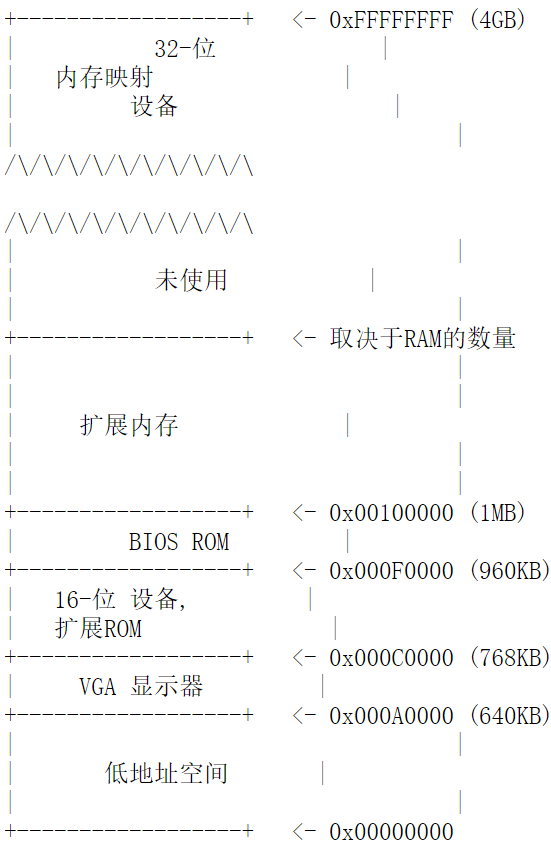

# Lab 1: Booting a PC / 启动PC

## Introduction / 介绍

本次的实验分为三个部分，第一部分主要熟悉一下 x86 汇编语言、QEMU 的 x86 模拟器和 PC 开机的引导过程。第二部分检查内核的引导加载程序，它位于实验源代码的 boot 文件夹中。最后，第三部分深入研究内核本身的初始化，相关代码在 kernel 目录中。在后文中，我们把内核命名为 JOS。

### 软件配置

本次实验和接下来的实验课程中所用到的所有文件，我们都使用 [Git](http://www.git-scm.com/) 版本控制系统来分发。想了解更多 Git 相关的信息，请查看 [Git user’s manual](http://www.kernel.org/pub/software/scm/git/docs/user-manual.html) , 如果你以前使用过其他的版本控制系统，这里有一个非常有用的 Git 的简单介绍 [CS-Oriented overview of Git](http://eagain.net/articles/git-for-computer-scientists/)。

::: warning 有关本课程的的Git远程仓库

本实验来自 MIT 的实验课程的 2018 版本，相关的内容我们已下载到本地的服务器中。请从 `环境搭建指南` 的 `下载实验工具包` 部分下载我们的 **实验所需源代码** `lab.zip` 开始实验。

解压缩后，实验相关的代码在 `lab` 文件夹下。

:::

### Getting Start / 开始

Git允许你跟踪你所修改的代码。例如你完成了一到两个练习，想要为你的进度做个检查点，可以通过以下指令来提交你的修改：

```bash
git commit -am 'my solution for lab1 exercise 9'
```

也可以通过 `git diff` 指令浏览你修改的内容。运行 `git diff` 将会显示从上次提交后你代码中的写改动，`git diff orign/lab1` 将会展示自从初始化代码后的全部改动。

你需要根据我们的 **环境搭建指南** 来安装 `qemu` 和 `gcc` 。我们对 `qemu` 进行过更改，加入了一些有用的调试功能，接下来的一些实验会用到这些修改的补丁，需要实验依赖的补丁因此，因此，你必须在你的机器上编译和安装我们修改过的 `qemu`，而不是下载 `qemu` 的发行版。~~如果你的机器用来自己的 ELF 的工具链（例如 Linux 和绝大多数的 BSD 的，但不是 OSX）你需要从你的安装包中安装一下 gcc 编译器，你可以按照工具页面上的说明进行操作。~~（不适用于我们的实验情况）

### Hand-In Procedure / 作业提交过程

我们会通过一个评定程序对你的解决方案进行一个评定。你可以通过评定程序并运行 `make grade` 来检测的你的解决方案。

不必运行 `make handin` 等其他文档中的命令，那些将会触发向 MIT 服务器的提交工作，对我们来说是无效的。也不要使用 `git pull`，`git fetch` 等操作。

## Part 1: PC Bootstrap / PC引导程序

第一个练习的目的是向你介绍有关 x86 汇编编程语言和 PC 的引导进程，并让你了解 QEMU 和 QEMU/GDB 的调试。接下来你并不需要为这个实验写任何的代码，但是为了你能更好的理解这个实验，你必须认真浏览一下。

### X86汇编入门

如果你之前并不怎么熟悉 x86 汇编语言，通过本课程你将会很快熟悉汇编语言。[PC Assembly Language Book](http://oslab.mobisys.cc/pdos.csail.mit.edu/6.828/2014/readings/pcasm-book.pdf) 是一本非常适合初学者的书。这本书里面包含了一些你可能听过或者没听过的特性，希望这能对你有助。

不过，不巧的是这本书上的例子是用的 `NASM` 汇编器，而我们用的是 `GNU` 的汇编器。`NASM` 用的是所谓的英特尔的语法而 `GNU` 使用的是 `AT&T` 的语法。即便是表达的是相同的意思，汇编文件也会有很大的不同，至少表面上是这样，不过对于两者之间的转换是非常简单的，两者间的转换在 [Brennan’s Guide to Inline Assembly](http://www.delorie.com/djgpp/doc/brennan/brennan_att_inline_djgpp.html) 深入讲解。


::: exercise 练习 1.

熟悉 [6.828 reference materials page](http://oslab.mobisys.cc/pdos.csail.mit.edu/6.828/2014/reference.html) 上提供的汇编语言的资料。你不需要马上阅读这部分的资料，但是实验的过程中你肯定会用这一部分资料。

我们建议阅读一下 [Brenna’s Guide to Inline Assembly](http://www.delorie.com/djgpp/doc/brennan/brennan_att_inline_djgpp.html) 的 `The Sytax` 这一部分的内容。这一部分内容给出了我们将在 JOS 中与 GUN 汇编器一起使用的 AT&T 汇编语法的一个很好的（非常简要的）描述。

:::

当然，x86 汇编语言的定义是根据英特尔架构的指令集合设计的，你可以在参考资料页面上看到这些内容：一个是 [80386 Programmer's Reference Manual](http://oslab.mobisys.cc/pdos.csail.mit.edu/6.828/2014/readings/i386/toc.htm)，这个版本相较于最新的 CPU 手册更加简短，但详细的描述了我们将要在 6.828 中使用的所有 x86 处理器的特点；最新，最全面英特尔的处理器资料是 [IA-32 Intel Architecture Software Developer's Manuals](http://www.intel.com/content/www/us/en/processors/architectures-software-developer-manuals.html)，这里面包含了很多英特尔处理器的新特性，我们课程中不会讲解，但是如果你感兴趣，可以自己去了解。[AMD](http://developer.amd.com/documentation/guides/Pages/default.aspx#manuals) 也提供了一套相同的（甚至更好理解的）处理器文档。保留一份 AMD 或者英特尔架构手册为以后的日常使用，以便在以后的你想了解或者查询某些处理器的特点或者指令方便使用。

### 模拟 x86

相较于在个人计算机上开发操作系统，我们用一个模拟 PC 的程序来进行开发：你为模拟器所编写的代码也可以在一个真实的 PC 上运行。用模拟器可以简化调试，举例来说，你可以在 x86 模拟器中设置一个断点去调试，这一点在真实的 x86 处理器上很难做到。

在实验中我们将使用 [QEMU 模拟器](http://www.qemu.org/)，一个更现代更快的模拟器。虽然 QEMU 内置了显示器仅提供了有限的调试功能，QEMU 可以当作 GNU 调试器的远程调试目标(GDB)，我们将在实验中使用这种方式，来完成早期的启动过程。

开始前，我们解压 `lab.zip` 中的文件到你的主机里，接下来在 `lab` 文件夹下输入 `make` 去构建最小的加载启动程序和内核。（现阶段把这些代码叫作 **内核** 确实有些名不符实，不过接下来的学期中我们将逐步的完善这份代码。）

```bash
cd lab
make
+ as kern/entry.S
+ cc kern/init.c
+ cc kern/console.c
+ cc kern/monitor.c
+ cc kern/printf.c
+ cc lib/printfmt.c
+ cc lib/readline.c
+ cc lib/string.c
+ ld obj/kern/kernel
+ as boot/boot.S
+ cc -Os boot/main.c
+ ld boot/boot
boot block is 414 bytes (max 510)
+ mk obj/kern/kernel.img
```

现在，你将要以上述过程编译出的 `obj/kern/kernel.img` 作为虚拟硬盘来运行 QEMU。这个硬盘镜像包含了我们需要的启动代码 bootloader（`obj/boot/boot`） 以及我们使用的内核（`obj/kernel`）

```bash
make qemu
# 对于 WSL 等，请使用↓
make qemu-nox
```

这条命令将执行 QEMU，默认的配置是使用编译出来的镜像作为硬盘，并将串行端口输出显示到终端上。某些文本应显示在QEMU窗口中：

```jos
Booting from Hard Disk...
6828 decimal is XXX octal!
entering test_backtrace 5
entering test_backtrace 4
entering test_backtrace 3
entering test_backtrace 2
entering test_backtrace 1
entering test_backtrace 0
leaving test_backtrace 0
leaving test_backtrace 1
leaving test_backtrace 2
leaving test_backtrace 3
leaving test_backtrace 4
leaving test_backtrace 5
Welcome to the JOS kernel monitor!
Type 'help' for a list of commands.
K>
```

从 `Booting from Hard Disk…` 后所有内容都是从我们的 JOS 内核打印出来的； `K> ` 是我们的小型内核监视器（或者准确地说，是包含在内核中的一个交互式控制程序）打出来的提示符。以上这些行也会出现在运行 QEMU 的常规 shell 窗口中。为了实现自动测试和评分，我们调整了 JOS 的内核将其控制结果的输出不仅写到了虚拟的 VGA 显示器中（能在 QEMU 窗口上看见的，用 WSL 的话，无法看见这个窗口），也输入到模拟 PC 的虚拟串行接口上，QEMU 将输出转为自己的标准输出，显示在屏幕上。同样的，JOS 内核也会接收来自于键盘和其它串行设备的输入，因此你既可以将指令输入到 VGA 的显示器上或输入到运行 QEMU 的终端上。另外，你也可以运行 `make qemu-nox` 使用没有 VGA 显示器的串行控制台。 如果你是用的 WSL，或是 SSH 远程登录的方式连接在服务器上进行实验，这可能很方便。

现在内核监视器只支持两种命令，`help` 和 `kerninfo`。试试看。

`help` 命令的作用很明显，我们接下来将简单讨论 `kerninfo` 命令打印内容的含义。虽然简单，但是需要注意的是，内核监视器是 **直接** 在 PC 模拟器的 **原生（虚拟）的硬件** 上运行的。 这意味着如果你将 `obj/kern/kernel.img` 的内容全部拷贝到硬盘的前几个扇区，将硬盘插入到你的实际的 PC 机器上，打开它，你会发现在你 PC 屏幕上的内容和你在 QEMU 窗口上所看到的内容将会是一样的。（我们不建议你用电脑来操作，一旦你将 `kernel.img` 的内容拷贝到你硬盘修改主引导记录，它会覆盖掉第一扇区的开头部分，这样硬盘上所有的东西都会丢失！）

### PC 的物理地址空间

现在我们将描述一下PC的启动过程。一个PC的物理地址空间具有以下大致的布局。



第一代PC是基于 16 位的 Intel8088 处理器设计的，只能处理 1MB 的物理内存。因此早期的 PC的物理地址空间都是以 `0x00000000` 开始，但不是以现在 `0xFFFFFFFF` 结束的而是 `0x000FFFFF`。前 `640KB` 区域被标记为 **低地址空间**，是早期 PC 唯一可以使用的随机访问存储区（RAM），事实上，早期的 PC 只配有 16KB, 32KB, 或者 64KB 的 RAM！

从 `0x000A0000` 到 `0x000FFFFF` 的 384KB 区域被保留下来用作硬件的一些特殊用途，比如视频播放的缓冲区和保存固件的非易失性内存空间。这一部分保留区域中最重要的一部分是基本的输入输出系统（简称BIOS）,占据了从 `0x000F0000` 到 `0x000FFFFF` 这 `64KB` 的区域。早期的 PC 机 BIOS 保存在只读内存区域，现在的 PC 机上的 BIOS 存储在新型的闪存存储器上。BIOS 负责执行系统的基本初始化，例如激活视频卡或者是检查内存安装的总量。在执行完初始化操作后，BIOS 将从一些合适的地方加载操作系统，例如软盘，硬盘，光盘，或者网络上，然后将机器的控制权交给操作系统。

英特尔的 80286 和 80386 处理器最终打破了 **一兆字节的瓶颈**，可以支持 16MB 和 4GB 的物理地址空间，可是 PC 的架构师依然要保留原来 1MB 的低地址的物理空间布局以保证现有软件的向下兼容性。因此，现代 PC 在 `0x000A0000` 到 `0x00100000` 的物理地址上有一部分 **空洞**，将RAM划分为两段，**低地址内存空间**（第一个 640KB 的内存空间）和 **扩展内存空间**（其余的部分）。此外，一些在 32 位机器的物理地址空间（最重要的是物理 RAM）最顶端的一些空间，通常被 BIOS 保存用作 32 位的 PCI 的设备使用。

最近 x86 的处理器能支持超过 4GB 的物理内存，因此 RAM 可以拓展到 `0xFFFFFFFF` 之上。在这种情况下 BIOS 必须要在 32 位系统内存高层预留第二个 **空洞**，用于为一些 32 位的设备预留映射空间。由于设计的限制，JOS只能使用前 265MB 的物理内存，现在我们假设电脑仅有一个连续的 32 位的物理地址空间。对于复杂的物理空间结构的管理和多种多样的已有设备的兼容，一直是 OS 不得不面对的一个问题，也是是未来发展中会一直存在的挑战。

### 只读存储器 BIOS

在这一部分实验中，你将使用 QEMU 的调试功能来检查一个 IA-32 兼容的计算机的引导过程。

打开两个终端窗口，在一个里面输入 `make qemu-gdb` (或者是 `make qemu-nox-gdb` )。这个将启动 QEMU，但是在 QEMU 将在处理器执行第一条指令前停止，并等待来自 GDB 的调试连接。在第二个终端窗口，在运行 make 那个目录运行 gdb，你可以看到像这样的一些信息：

```gdb
The target architecture is assumed to be i8086
[f000:fff0] 0xffff0: ljmp   $0xf000,$0xe05b
0x0000fff0 in ?? ()
+ symbol-file obj/kern/kernel
(gdb)
```

::: warning 提示

如果你取得的是旧版代码或旧版教程，可能要在 `~/.gitinit` 中添加一些代码才能正确执行。GDB 会对此给出提示，请按照 GDB 的提示操作。

:::

注意这一行:

```gdb
[f000:fff0] 0xffff0: ljmp   $0xf000,$0xe05b
```

这是 GDB 对要执行的第一条指令拆解。从这个输出我们可以总结出以下几件事情：

+ IBM 的 PC 是从物理地址是 0x000FFFF0 的内存位置开始执行的，这是为只读存储器 BIOS 保留的 64KB 的区域的最顶端。PC开始执行时 CS = 0xF000 和 IP = 0xFFF0
+ 第一条被执行的指令是 jmp 指令，跳转到分区地址是 CS = 0xF000 和 IP = 0x305B

为什么 QEMU 是这样开始的？这是完全按照英特尔设计的 8088 处理器工作的，也就是模拟了 IBM的 PC 机上的处理器工作模式。因为在 PC 中， BIOS 是通过 **硬件接线** 的方式连接到物理地址 `0x000F0000` - `0x000FFFFF` 这段范围上，这种设计能确保 BIOS 在电脑后充电后开机或者是任何操作系统重启后立刻获取到机器的控制权。这十分的重要，因为重启后 RAM 中不会有任何的软件可供处理器执行。QEMU 模拟器有自己的 BIOS，它位于处理器模拟的物理地址空间的位置上。在处理器复位的时候，（模拟）处理器进入实模式将 CS 设置到 `0xF000` 并且将 IP 设置到 `0xFFF0` ,以便从（CS：IP）地址开始执行。分段机制地址 `0xF000:FFF0` 如何转为物理地址的呢？

为了回答这个问题，我们必须了解一些实际模式寻址的知识。在实际模式（PC 的启动模式），地址翻译是根据公式： 物理地址 =  16 * 段 + 偏移。因此。当将 PC 的 CS 设置为 0xf000 IP 设置为 0xfff0，物理地址就是：

```magic
16 * 0xf000 + 0xfff0   # 在 16 进制下乘以 16
   = 0xf0000 + 0xfff0  # 只追加一个 0
   = 0xffff0
```

0xFFFF0 是 BIOS（0x100000）最后 16 个字节的地址。因此，BIOS 做的第一件事是通过 jmp 跳转到在 BIOS 较前的位置。毕竟在 16 字节中能完成的工作是很有限的。

::: exercise 练习 2.

使用 GDB 的 `si` (Step Instruction) 指令来跟踪 ROM BIOS 中的几个指令，并且尝试这些指令是要做什么的。你可能需要查看 [Phil Storrs I/O Ports Description](http://web.archive.org/web/20040404164813/members.iweb.net.au/~pstorr/pcbook/book2/book2.htm) ，以及[6.828 reference materials page](http://oslab.mobisys.cc/pdos.csail.mit.edu/6.828/2014/reference.html) 其他的资料。并不需要弄清楚所有的细节 —— 仅需要先弄清楚 BIOS 工作的一个思路。

:::

当BIOS 运行起来，他建立了一个中断描述符表，并初始化例如 VGA 设备各种变量。这就是为什么会从 QEMU 窗口上看到 **Starting SeaBIOS** 信息。

当初始化了 PCI 总线和所有 BIOS 知道的重要设备后。它开始搜索启动设备例如软盘，硬盘，光盘等。最终，当找到了一个启动磁盘，BIOS 就开始从磁盘里面读取启动加载程序，并将电脑的控制权转让给启动程序。

## Part2：引导加载程序

PC 的软盘和硬盘以 512 个字节为单位划分成区域，每个区域称为一个扇区。扇区是磁盘的最小访问单位：每个读、写操作的大小必须是一个或多个扇区，并在扇区边界上对齐。如果磁盘是可引导的，则第一个扇区称为引导扇区，因为这是引导加载程序代码所在的位置。当 BIOS 找到可启动的软盘或硬盘时，将 512 字节的引导扇区加载到物理地址 0x7C00 到 0x7DFF 的内存中，然后使用 jmp 指令将 `CS:IP` 设置为 `0000:7C00`，将控制权传递给引导程序。引导程序又称为 bootloader。像 BIOS 加载地址一样，这些地址是随意设定的 —— 但对于 PC 来说，它们是固定和标准化的。

在 PC 的演进过程中，从 CD-ROM 启动的能力要晚很多才出现，因此，PC 架构师借此机会重新思考引导过程。因此，现代 BIOS 从 CD-ROM 启动的方式有点复杂（且更强大）。CD-ROM 使用 2048 字节大小的扇区，而不是 512 字节，并且在将控制转移给它之前，BIOS 可以将更大的启动映像从磁盘加载到内存（而不仅仅是一个扇区）中。有关详细信息，请参阅 ["El Torito" Bootable CD-ROM Format Specification](http://oslab.mobisys.cc/pdos.csail.mit.edu/6.828/2014/readings/boot-cdrom.pdf)。但是，在我们的实验中，我们将使用传统的硬盘启动机制，这意味着我们的引导加载程序必须放进 512 字节的区域中。引导加载程序由两个文件组成，一个汇编语言源文件 `boot/boot.S` 和一个 C 语言源文件 `boot/main.c`。仔细阅读这些源文件，并确保你了解发生了什么。引导加载程序必须执行两个主要功能：

首先，引导加载程序将处理器从实模式切换到 32 位保护模式，因为只有在该模式下，软件才能访问处理器物理地址空间中 1MB 以上的所有内存。保护模式在 [PC Assembly Language](http://oslab.mobisys.cc/pdos.csail.mit.edu/6.828/2014/readings/pcasm-book.pdf) 第 1.2.7 和 1.2.8 节中有简要介绍，并在英特尔架构手册中有详细介绍。在这个阶段上，你只需要理解，在保护模式下，将分段地址（段地址：偏移量的组合）转换为物理地址的方式不同，而转换后的偏移量为 32 位而不是 16 位。

其次，引导加载程序通过 x86 特殊的 I/O 指令直接访问 IDE 磁盘设备寄存器，从硬盘读取内核。如果你想更好地了解这里的 *特殊 I/O 指令* 是什么意思，请查看 [6.828 reference page](http://oslab.mobisys.cc/pdos.csail.mit.edu/6.828/2014/reference.html) 的 IDE 硬盘驱动器控制器 `IDE hard drive controller` 部分。在本课程中, 你不需要了解编程特定设备的情况：编写设备驱动程序实际上是操作系统开发中非常重要的一部分，但从概念或架构的角度来看，它也是最无趣的一部分。

在了解了引导加载程序的源代码后，查看文件 `obj/boot/boot.asm`。该文件是我们的 `GNUmakefile` 在编译引导加载程序之后创建的引导加载程序的反汇编代码。从这个反汇编文件中可以很容易地查看所有引导加载程序代码所在的物理内存的确切位置，并且可以更轻松地监视 GDB 中的引导加载程序中发生的情况。同样，`obj/kern/kernel.asm` 中包含的是 JOS 内核的反汇编结果，这通常对调试很有用。

你可以使用 `b` 命令在 GDB 中设置地址断点。例如，`b *0x7c00` 设置地址 `0x7C00` 的断点。一旦执行停在了断点处，可以使用继续执行 `c` 与 `si` 命令：`c` 使 QEMU 继续执行，直到下一个断点（或者直至你在 GDB 按下 `Ctrl-C`）；`si N` 的意思是连续执行 `N` 条指令后停下来。

要检查内存中的指令（GDB 会自动打印出马上要执行的下一个指令，但并不会显示其他指令），请使用该 `x/i` 命令。该命令的语法是 `x/Ni ADDR` ，其中 `N` 是要反汇编的连续指令的数量，`ADDR` 是要开始反汇编的存储器地址。

::: exercise 练习 3.

查看 [lab tools guide](http://oslab.mobisys.cc/pdos.csail.mit.edu/6.828/2014/labguide.html)，特别是 GDB 命令部分。即使你熟悉GDB，这包括一些对操作系统工作非常有用且深奥 GDB 命令。

在地址 `0x7c00` 设置断点，这是引导扇区将被加载的位置。继续执行直到那个断点。跟踪 `boot/boot.S` 中的代码，使用源代码和反汇编文件 `obj/boot/boot.asm` 来跟踪你在哪里。还可以使用 GDB 中的 `x/i` 命令来反汇编引导加载程序中的指令序列，并将原始引导加载程序源代码与 `obj/boot/boot.asm` 和 GDB 中的反汇编进行比较。

在 `boot/main.c` 中跟踪到 `bootmain()`，然后进入 `readsect()`。识别与 `readsect()` 中的每个语句相对应的确切的汇编指令。完成对 `readsect()` 其余部分跟踪，并回到 `bootmain()` ，并找到用来从盘读取内核其余部分的 for 循环的开始和结束的位置。找出循环完成后运行的代码，在那里设置一个断点，并继续执行到该断点。然后再走完 `bootloader` 程序的其余部分。

:::

确保你可以回答以下问题：

+ 处理器什么时候开始执行 32 位代码？如何完成的从 16 位到 32 位模式的切换？
+ 引导加载程序 bootloader 执行的最后一个指令是什么，加载的内核的第一个指令是什么？
+ 内核的第一个指令在哪里？
+ 引导加载程序如何决定为了从磁盘获取整个内核必须读取多少扇区？在哪里可以找到这些信息？

### 加载内核

现在我们将进一步详细介绍在 `boot/main.c` 中 `bootloader` 程序的 C 语言部分。在这之前，需要回顾一些 C 编程的基础知识。

::: exercise 练习 4.

阅读 C 中的指针编程。C 语言的最佳参考是 Brian Kernighan 和 Dennis Ritchie（被称为 K＆R）的 [C编程语言（中文翻译版）](http://video.mobisys.cc/materials/tools/CProgrammingLanguageCN.pdf)。

通读 K＆R 书中 5.1（指针和地址）到 5.5（字符指针和函数）的内容。然后下载 [pointers.c](http://video.mobisys.cc/materials/tools/pointers.c) 的代码，运行它，并确保你了解所有打印值的来源。特别是，请确保你理解第 1 行和第 6 行中指针指向哪里的地址，第 2 行到第 4 行的值是如何被写入的，以及为什么第 5 行中打印的值看起来像是错乱的。

还有其他有关C指针的参考书（例如，[A tutorial by Ted Jensen](http://video.mobisys.cc/pages/pdos.csail.mit.edu/6.828/2014/readings/pointers.pdf)，其中大量引用了 K＆R 的内容）。

警告： 除非你已经彻底掌握了 C 语言，否则不要跳过这段阅读练习。如果你真的不了解 C 中的指针，那么在后续的实验中你将会遭受无法忍受的痛苦，最后会很难理解他们。相信我们，你肯定不想知道 **很难** 到底是多难的。

:::

为了能够理解 `boot/main.c`，你需要知道什么是 ELF 二进制文件。当你编译和链接 C 程序（如 JOS 内核）时，编译器会将每个 C 源文件（`.c`）转换为对象文件（`.o`），其中包含了以硬件预期的二进制格式编码的汇编语言指令。链接器随后将所有编译的对象文件合并成一个二进制镜像文件，如 `obj/kern/kernel`，在这种情况下，我们把他叫作是 ELF 格式的二进制形式，代表 `Executable and Linkable Format`（可执行和可链接格式）。

有关此格式的完整信息可在 [reference page](http://oslab.mobisys.cc/pdos.csail.mit.edu/6.828/2014/reference.html) 上的 [the ELF specification](http://oslab.mobisys.cc/pdos.csail.mit.edu/6.828/2014/readings/elf.pdf) 获得，但你不需要深入了解此类中此格式的详细信息。虽然整体格式是相当强大和复杂的，但大部分复杂的部分是为了支持动态加载共享库，我们不会在作业中涉及这部分内容。在 [Wikipedia page](http://en.wikipedia.org/wiki/Executable_and_Linkable_Format) 有一个简短的描述。

如果只是为了完成本实验，你可以简单地将 ELF 可执行文件理解为具有加载信息的文件头部，后跟几个程序片段，每个程序片段都是连续的代码或数据块，用于加载到内存中指定的地址处。引导加载程序不会修改代码或数据; 它将其加载到内存中并开始执行它。

ELF 二进制文件以固定长度的 ELF 头开始，后面是一个可变长度的程序头，程序头中列出了要加载的每个程序段。这些 ELF 头的 C 定义在 inc/elf.h 中。我们感兴趣的程序部分是：

+ `.text`：程序的可执行指令。
+ `.rodata`：只读数据，如 C 编译器生成的 ASCII 字符串常量（虽说是只读，我们并不会专门设置硬件来禁止写操作）。
+ `.data`：数据部分保存程序的初始化数据，例如用 `int x = 5` 初始化时声明的全局变量。

当链接器计算程序的存储器布局时，它会为未初始化的全局变量保留空间（例如 `int x` 这种变量），这些变量会放在一个名为 `.bss` 的段中，紧跟着 `.data` 的后面。C 要求 `未初始化` 的全局变量自动被初始化为 `0`，因此，不需要存储 `.bss` 部分。链接器只记录了 `.bss` 段的地址和大小。加载程序或程序本身必须将 `.bss` 部分置零。

通过键入以下内容，检查内核可执行文件中所有部分的名称，大小和链接地址的完整列表：

```bash
objdump -h obj/kern/kernel
```

你会看到比上面列出的更多部分，但其他部分对我们的目的来说并不重要。其他的大多数都是保存调试信息，这通常包含在程序的可执行文件中，但不由加载程序加载到内存中。

特别注意 `.text` 部分的 `VMA`（或者说链接地址 `link address` ）和 `LMA`（或者说加载地址 `load address`） 。每部分的加载地址是将该部分加载到内存中的内存地址。

段的链接地址是该段期望执行的内存地址。链接器在生成的二进制程序中大量使用链接生成的绝对地址，例如当代码中需要某个全局变量的地址时会直接使用由链接器生成的变量的链接地址，但这样做的结果是，如果二进制文件没有被加载到链接地址，而是从一个地址开始执行时，它会产生很多链接地址错误。（生成不包含任何这样的绝对地址的位置无关代码也是可以做到的，这种技术在现代共享库中广泛使用，但它当然也会引入性能和复杂性的代价，所以我们不会在本实验中使用它）。

通常，链接和加载地址是相同的。例如，查看引导加载程序的 `.text` 部分：

```bash
objdump -h obj/boot/boot.out
```

bootloader 程序使用 ELF 程序头来决定如何加载这部分。程序头指定要加载到内存中的 ELF 对象的段的位置以及每个段应该占用的目标地址。你可以通过键入以下内容检查内核的程序头：

```bash
objdump -x obj/kern/kernel
```

然后程序头在 `objdump` 的输出中的 `Program Headers` 下列出。需要加载到内存中的 ELF 对象的区域是标记为 `LOAD` 的区域。它还提供了每个程序头的其他信息，例如虚拟地址（`vaddr`），物理地址（`paddr`）和加载区域的大小（`memsz` 和 `filesz`）。

下面我们回到 `boot/main.c` 的代码分析中，每个程序头的 `ph->p_pa` 字段包含段的目标物理地址（在这种情况下，它实际上是一个物理地址，尽管 ELF 规范对该字段的实际含义是模糊的）。

BIOS 将引导扇区加载到内存地址 `0x7C00` 处，这个地址是引导扇区的加载地址。这也是引导扇区开始执行的地方，所以这也是它的链接地址。我们通过在 `boot/Makefrag` 中利用参数 `-Ttext 0x7C00` 传递给链接器，以设置链接地址。有了这个配置，链接器将在生成的代码中产生正确的内存地址。

::: exercise 练习 5.

跟踪 `bootloader` 程序的前几个指令，找到开始使用链接地址的第一条指令，即，如果你使用了错误的链接地址，那么执行到这里的时候就必须要停下来，否则就会发生错误。然后将 `boot/Makefrag` 中的链接地址更改为一个错误的地址，运行 `make clean`，用 `make` 命令重新编译实验，然后再次跟踪到引导加载程序，看看会发生什么。不要忘了改变链接地址后要再次执行 `make clean`！

:::

再来看一下内核的加载和链接地址。与 `bootloader` 程序不同，这两个地址不一样：内核告诉引导加载程序将其加载到低地址（1兆字节）的内存中，但它希望从高地址执行。我们将在下一节中介绍我们如何实现这一过程的。

除了段信息之外，`ELF Header` 中还有一个对我们很重要的字段，叫做 `e_entry`。该字段保存程序中入口点的链接地址：在程序的代码段中，开始执行的第一条语句在内存中的位置地址。你可以通过以下命令看到入口点：

```bash
objdump -f obj/kern/kernel
```

你现在应该能够了解 `boot/main.c` 的意义了，这是一个最简单的 ELF 加载程序。它将内核的每个部分从磁盘读取到存储区的加载地址，然后跳转到内核的入口点。

::: exercise 练习 6.

我们可以使用 GDB 的 x 命令检查内存。 [GDB manual](http://sourceware.org/gdb/current/onlinedocs/gdb_9.html#SEC63) 中详细讲解了命令的用法，但就目前而言，知道命令 `x/Nx ADDR` 能够在 `ADDR` 处打印 `N` 个存储器字就足够了。（请注意，命令中的 `x` 均为小写。） 警告：字的大小不是通用标准。在 GNU 程序集中，一个字是两个字节（`xorw` 中的 `w`，代表字，表示 2 个字节）。

复位机器（退出 `QEMU / GDB` 并再次启动）。在 BIOS 进入引导加载程序的那一刻停下来，检查内存中 `0x00100000` 地址开始的 8 个字的内容，然后再次运行，到 `bootloader` 进入内核的那一点再停下来，再次打印内存 `0x00100000` 的内容。为什么这 8 个字的内容会有所不同？第二次停下来的时候，打印出来的内容是什么？（你不需要使用QEMU来回答这个问题，思考即可）

:::

## Part3: 内核

现在我们将开始更详细的了解 JOS 内核(你终于可以开始写一些代码了)。像 bootloader 程序一样，内核开始于一些汇编语言代码，用于将一切准备就绪，以便 C 语言代码可以正常执行。

### 使用虚拟内存解决位置依赖问题

当你检查上面的 bootloader 程序的链接和加载地址时，它们是完全匹配的，但内核的链接地址（由 `objdump` 打印）与其加载地址之间存在一个（相当大的）差异。回去检查这两个概念，确保你可以看懂我们在说什么。 （链接内核比引导加载程序更复杂，链接和加载地址位于 `kern/kernel.ld` 的顶部。）

操作系统内核通常喜欢链接并运行在非常高的虚拟地址（例如 `0xf0100000` ），以便留下处理器虚拟地址空间的较低部分供用户程序使用。 在下一个实验中，这种安排的原因将变得更加清晰。

许多机器在地址 `0xf0100000` 没有任何物理内存，所以我们不能指望能够在那里存储内核。 相反，我们将使用处理器的内存管理硬件将虚拟地址 `0xf0100000`（内核代码期望运行的链接地址）映射到物理地址 `0x00100000`（引导加载程序将内核加载到物理内存中的位置）。 这样，尽管内核的虚拟地址足够高，为用户进程留下了足够的地址空间，但它将被加载到 PC RAM 内的 1MB 的物理内存中，就在 BIOS ROM 的上方。 这种方法要求 PC 具有至少几兆字节的物理内存（从而物理地址 `0x00100000` 的位置是是有可用的物理内存的），在 1990 年左右之后，任何一台 PC 都有这么多内存。

实际上，在下一个实验中，我们将把 `256MB PC` 的物理地址空间从物理地址 `0x00000000` 到 `0x0fffffff` 映射到虚拟地址 `0xf0000000` 到 `0xffffffff`。 你现在应该会知道为什么 `JOS` 只能使用第一个 `256MB` 的物理内存了。

现在，我们将映射前 `4MB` 的物理内存，这足以让我们开始运行。我们在 `kern/entrypgdir.c` 中使用手写的，静态初始化的页面目录和页面表来执行此操作。在本实验中，你不必了解这个工作的细节，只需要知道它实现的效果。直到 `kern/entry.S` 设置 `CR0_PG` 标志，内存引用被视为物理地址（严格来说，它们是线性地址，但是 `boot/boot.S` 中把线性地址和物理地址设置成了一致的，我们后面也不会再改变这个配置了）。一旦设置了 `CR0_PG`，内存引用就变成了虚拟地址，虚拟内存硬件转换为物理地址。`entry_pgdir` 将 `0xf0000000` 至 `0xf0400000` 范围内的虚拟地址转换为物理地址 `0x00000000` 至 `0x00400000`，同时也将虚拟地址 `0x00000000` 至 `0x00400000` 转换为物理地址 `0x00000000` 至 `0x00400000`。任何不在这两个范围之一的虚拟地址将导致硬件异常，因为我们还没有设置中断处理，将导致 `QEMU` 打印出机器状态并退出（如果你没有使用我们实验提供的带补丁的 QEMU，则会无休止地重新启动）。

::: exercise 练习 7.

使用 QEMU 和 GDB 跟踪到 JOS 内核并停止在 `movl％eax，％cr0`。 查看内存中在地址 `0x00100000` 和 `0xf0100000` 处的内容。 下面，使用 GDB 命令 `stepi` 单步执行该指令。 指令执行后，再次检查 `0x00100000` 和 `0xf0100000` 的内存。 确保你明白刚刚发生的事情。

新映射建立后的第一条指令是什么，如果映射配置错误，它还能不能正常工作？ 注释掉 `kern/entry.S` 中的 `movl％eax，％cr0`，再次追踪到它，看看你的猜测是否正确。

:::

### 格式化打印到控制台

大多数人认为像 `printf()` 这样的功能是理所当然的，有时甚至将它们视为 C 语言的 **原始本能**。 但是在操作系统内核中，我们必须自己实现所有的 I/O。

阅读 `kern/printf.c`，`lib/printfmt.c` 和 `kern/console.c`，并确保你了解他们的关系。以后的实验室会清楚，为什么 `printfmt.c` 位于 `lib` 目录中。

::: exercise 练习 8.

我们省略了一小段代码 —— 使用 `％o` 形式的模式打印八进制数字所需的代码。查找并补全这个代码片段。

:::

确保你现在能够回答下面的问题：

+ 解释 `printf.c` 和 `console.c` 之间的接口。具体来说，`console.c` 导出了什么函数？`printf.c` 是如何使用这些函数的？
+ 解释 `console.c` 的以下内容：

  

+ 对于以下问题，你可能需要参考一些课外资料。

  跟踪以下代码的并单步执行：

  ```c
  int x = 1, y = 3, z = 4;
  cprintf("x %d, y %x, z %d\n", x, y, z);
  ```

  + 在调用 `cprintf()` 时，`fmt` 是什么意思？ `ap` 是什么意思？
  + 按执行顺序列出每次调用 `cons_putc`，`va_arg` 和 `vcprintf` 这三段代码时的细节。 对于 `cons_putc`，列出其参数。 对于 `va_arg`，列出调用之前和之后的 `ap` 指针的指向。 对于 `vcprintf`，列出其两个参数的值。

+ 运行下面的代码

  ```c
  unsigned int i = 0x00646c72;
  cprintf("H%x Wo%s", 57616, &i);
  ```

  输出是什么？如何按照上一个练习的执行步骤，说明为什么会显示这个输出信息。可以参考将字节映射到字符的 [ASCII表](http://web.cs.mun.ca/~michael/c/ascii-table.html)。

  由于 x86 是小端的，所以得到了上面的输出结果。如果 x86 是大端，那么为了产生相同的输出，你会设置什么？你需要将 57616 更改为不同的值吗？[这里](http://www.webopedia.com/TERM/b/big_endian.html)是一个关于大小端的描述，[这里](http://www.networksorcery.com/enp/ien/ien137.txt)是一个更加脑洞大开的说法。

+ 在下面的代码中，将在 `y =` 之后打印什么（注意：答案不是一个固定的值）？为什么会发生这种情况？

  ```c
  cprintf("x=%d y=%d", 3);
  ```

+  假设 GCC 更改了它的调用约定，以声明的顺序将参数压入栈中，这样会使最后一个参数最后被压入。 你将如何更改 `cprintf` 或其接口，以便仍然可以传递一个可变数量的参数？

::: challenge 挑战！

增强控制台的能力以允许以打印不同颜色的文本。传统的方法是使它解析嵌入在待打印的文本字符串中的 ANSI 转义序列，但是你可以使用任何你喜欢的机制。 在实验的 [参考内容](http://oslab.mobisys.cc/pdos.csail.mit.edu/6.828/2014/reference.html) 和网络上其他地方有对 VGA 显示硬件进行编程的大量信息。 如果你真的喜欢挑战，也可以尝试将 VGA 硬件切换到图形模式，并使控制台将文本绘制到图形帧缓冲区上。

:::

### 栈

在本实验的最后一个练习中，我们将更详细地探讨 C 语言在 x86 上使用栈的方式，并编写一个新的内核监视器函数，该函数能够实现栈的回溯打印：一个保存引导到当前执行点的嵌套调用指令的指令指针（IP）值的列表。

::: exercise 练习 9.

确定内核在哪里完成了栈的初始化，以及栈所在内存的确切位置。内核如何为栈保留空间？栈指针初始化时指向的是保留区域的哪一端？

:::

x86 栈指针（esp寄存器）指向栈当前正在使用的最低地址位置。所有低于这个位置的栈保留区域都是空闲的。将值压入到栈时，首先会将栈指针的值减少，然后将值写入栈指针指向的位置。 从栈中弹出一个值，需要读取栈指针指向的值，然后增加栈指针。 在 32 位模式下，栈只能保存 32 位值，而 esp 总是可以被 4 整除。各种 x86 指令（如函数调用）都是与硬件绑定的，会固定使用栈指针寄存器来操作数据。

ebp（基地址指针）寄存器与栈的关联关系来自于软件设计的传统。在进入 C 函数时，函数的前导代码通常会将之前的函数的基地址寄存器（ebp）压入堆栈，然后在函数的运行过程中会将当前的 esp 值复制到 ebp 中。 如果程序中的所有函数都遵循这一约定，那么在程序执行期间的任何给定点，可以通过遵循保存的 ebp 指针链来精确地还原出整个 ebp 的保存链，并用于确定出整个函数的调用序列。这种特性特别有用，例如，因为传递错误的参数，一个特定的函数导致 assert 失败或 panic，但你不确定谁传递了错误的参数。 栈回溯可以让你找到有问题的函数。

::: exercise 练习 10.

熟悉 x86 上 C 语言函数的调用约定，在 `obj/kern/kernel.asm` 中找到 `test_backtrace` 函数的地址，在其中设置一个断点，并检查在内核启动后每次这个函数被调用时会发生什么。 每一级的 `test_backtrace` 在递归调用时，会在栈上压入多少个 32 位的字，这些字的内容是什么？

请注意，为了使此练习正常工作，你应该使用工具页中修改过QEMU。 否则，你必须手动将所有断点和内存地址转换为线性地址。

:::

上述练习应该能够提供实现栈回溯函数所需的信息，我们将它命名为 `mon_backtrace()`。 这个函数的原型已经在 `kern/monitor.c` 中定义好了。你可以完全在 C 语言中读取 ebp，但你也可以用 `inc/x86.h` 中的 `read_ebp()` 函数。 你还必须将这个新功能添加到内核监视器的命令列表中，以便用户可以通过命令交互式地调用它。

回溯功能应显示以下格式的功能调用列表：

```backtrace
Stack backtrace:
  ebp f0109e58  eip f0100a62  args 00000001 f0109e80 f0109e98 f0100ed2 00000031
  ebp f0109ed8  eip f01000d6  args 00000000 00000000 f0100058 f0109f28 00000061
  ...
```

打出的第一行反映了当前正在执行的函数，即 `mon_backtrace` 本身，第二行反映的是调用 `mon_backtrace` 的函数，第三行反映了调用该函数的函数，依此类推。 你应该打印所有的堆栈帧。通过了解 `kern/entry.S`，你会发现有一个简单的方法来告诉你这个链条的回溯应该到什么时候停止。

每行包含一个 `ebp`，`eip` 和 `args`。`ebp` 的值表示的是该函数在栈中的基地址，即刚刚进入到函数的代码时栈指针的位置，在函数的前导代码中完成这个指针的设置。列出的 `eip` 值是函数的返回指令指针，即当函数返回时控制流会返回到的指令地址。返回指令指针通常指向 `call` 指令后的指令（为什么？）。 最后，`args` 之后列出的 `5` 个十六进制值是当前函数的前 5 个参数，这些参数会在函数调用之前被压入到栈中。 如果函数被调用的参数少于 5 个，那么当然并不是所有这 5 个值都是有意义的（为什么回溯代码不能检测到实际有多少个参数？用什么方法可以弥补这个缺陷？）。

以下是你在 [K＆R 的书](http://video.mobisys.cc/materials/tools/CProgrammingLanguageCN.pdf) 第 5 章的阅读时应注意到的几个具体要点，为了接下来的联系和以后的实验，你应该记下来。

+ 如果 `int *p =（int *）100` ，则`(int)p + 1` 和 `(int)(p + 1)` 是不一样的：第一个是 `101`，但第二个是 `104`。当向指针加上一个整数时， 在第二种情况下，整数默认会乘以指针指向的对象的大小。
+ `p[i]` 的定义与 `*(p + i)` 相同，指的是 `p` 指向的存储器中的第 `i` 个对象。上述的规则在对象大于一个字节时是非常需要注意的。
+ `&p[i]` 与 `(*p + i)` 相同，是 `p` 指向的存储器中的第 `i` 个对象的地址。

虽然大多数 C 程序不需要在指针和整数之间进行转换，但操作系统经常这么做。 每当你看到一个内存地址的加法操作时，需要想清楚是一个整数加法还是一个指针加法，并确保要相加的值是不是要乘以每个对象的大小。

::: exercise 练习 11.

实现如上所述的回溯功能。请使用与示例中相同的格式，否则打分脚本将会出错。当你认为你的工作正确的时候，运行 `make grade` 来看看它的输出是否符合我们的打分脚本的期待，如果没有，修正发现的错误。在你成功提交实验 1 的作业后，欢迎你以任何你喜欢的方式更改回溯功能的输出格式。

如果你使用 `read_ebp()`，请注意，GCC 可能会生成优化后的代码，导致在 `mon_backtrace()` 的函数前导代码之前调用 `read_ebp()`，从而导致堆栈跟踪不完整（最近的函数调用的堆栈帧丢失）。~~我们可以尝试禁用优化以避免此重新排序的优化模式~~ 如果你遇到了这个问题，不需要解决它，只要能够解释它即可。你可能需要检查 `mon_backtrace()` 的汇编代码，并确保在函数前导代码之后调用的 `read_ebp()`。

:::

此时，你的 `backtrace` 函数应该为你提供调用 `mon_backtrace()` 的函数在栈上的地址。但是，在实践中，你经常想知道与这些地址对应的函数名称。 例如，你可能想知道哪些函数可能包含导致内核崩溃的错误。

为了帮助你实现此功能，我们提供了函数 `debuginfo_eip()`，该函数能够在符号表中查找 `eip` 并返回该地址的调试信息。这个函数在 `kern/kdebug.c` 中定义。

::: exercise 练习 12.

修改你的堆栈回溯功能，为每个 `eip` 显示与该 `eip` 对应的函数名称，源文件名和行号。

在 `debuginfo_eip` 中 `__STAB_ *` 来自哪里？这个问题的答案可能很长。为了帮助你找到答案，以下是你可能想要做的一些事情：

+ 在文件 `kern/kernel.ld` 中查找 `__STAB_*`
+ 运行 `objdump -h obj/kern/kernel`
+ 运行 `objdump -G obj/kern/kernel`
+ 运行 `gcc -pipe -nostdinc -O2 -fno-builtin -I. -MD -Wall -Wno-format -DJOS_KERNEL -gstabs -c -S kern/init.c`，并查看 `init.s`
+ 看看 `bootloader` 是否在内存中加载了符号表，作为加载内核二进制文件的一部分

通过插入对 `stab_binsearch` 的调用来查找地址的行号，补全 `debuginfo_eip` 的实现。

向内核监视器添加一个 `backtrace` 命令，并扩展你的 `mon_backtrace` 的实现，调用 `debuginfo_eip` 并为每个堆栈框架打印一行：

```jos
K> backtrace
Stack backtrace:
  ebp f010ff78  eip f01008ae  args 00000001 f010ff8c 00000000 f0110580 00000000
         kern/monitor.c:143: monitor+106
  ebp f010ffd8  eip f0100193  args 00000000 00001aac 00000660 00000000 00000000
         kern/init.c:49: i386_init+59
  ebp f010fff8  eip f010003d  args 00000000 00000000 0000ffff 10cf9a00 0000ffff
         kern/entry.S:70: <unknown>+0
K>
```

每一行给出栈帧的 `eip`，以及这个代码所在的文件的文件名和行，后面是函数的名称和 `eip` 与函数的第一条指令的偏移（例如，`monitor+106` 表示返回 `eip` 是从 `monitor` 函数开始的第 106 字节）。

确保在单独的行上打印文件和函数名称，以避免让打分脚本感到困惑。

提示：`printf` 格式的字符串提供了一种简单的方法来打印非空终止的字符串，如 `STABS` 表中的字符串。 `printf("％.* s"，length，string）`打印长度最长为 `length` 的字符串。 看看 `printf` 手册页，找出这一段的工作原理和使用方法。

你可能会发现回溯中少了一些函数。 例如，你可能会看到对 `monitor()` 的调用，但不会看到对 `runcmd()` 的调用。 这是因为编译器内联一些函数调用。 其他优化可能会导致你看到的行号和代码中的不太一样。 如果你从 `GNUMakefile` 中删除 `-O2` ，那么回溯可能会更容易理解一些（但内核运行速度会更慢）。

:::

到了这里，Lab 1 就结束了。在实验目录中，使用 `git commit <?后面是什么>` 来提交你的更改。


---

译： Unknown  

校： Sun Yi-Ran (sunrisefox@vampire.rip)

如有翻译错误，请务必联系喵 ，以便及时更正  

[CC BY-SA 4.0](https://creativecommons.org/licenses/by-sa/4.0/)

HTML 编译： [Vampire Markdown Printer](https://github.com/SunriseFox/vampire-markdown-printer)
