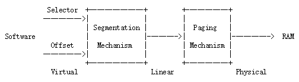

# Lab 2: Memory Management 内存管理

## Introduction / 介绍

在本实验中，你将为操作系统编写内存管理代码。内存管理有两个组件。

第一个组件是内核的物理内存分配器，因此内核可以在需要时分配内存并用完后释放它。你的分配器将以 4096 个字节为单位进行操作，这个单位被称为一个页(page)。你的任务是维护一个数据结构，用于记录哪些物理页面是空闲的，哪些物理页面已经被分配，以及每个分配的页面正在被几个进程所共享。你还将编写例程以分配和释放内存页面。

内存管理的第二个组件是虚拟内存，它将内核和用户软件使用的虚拟地址映射到物理内存中的地址。当指令使用内存时，x86 硬件的内存管理单元（MMU）会根据一组页表时完成地址映射。你将根据我们提供的规范修改 JOS 以设置 MMU 的页表。

### Getting Start / 开始

在本次实验和以后的实验中，你将逐步构建你自己的内核。我们还将为你提供一些额外的源代码。要获取这些源代码，需要使用 Git 来提交你在上交 Lab 1 之后的代码更改（如果有的话），~~从课程容器中获得最新版本的代码~~（我们不需要这么做），并基于我们的 lab2 分支 **origin/lab2** 创建一个新的本地分支 **lab2**：

```bash
cd ~/6.828/lab
git commit -am 'changes to lab1 after handin'
# git pull
git checkout -b lab2 origin/lab2
git merge lab1
```

上面展示的 `git checkout -b` 命令实际上做了两件事情：它首先基于课程人员提供的 `origin/lab2` 分支创建一个本地分支`lab2`，其次，它会把你的实验目录中的内容更改为存储在 lab2 分支上的文件。Git 允许用 `git checkout branch-name` 在已有分支之间进行切换，但在切换到另一个分支之前，你应该提交在当前分支上所有未提交的更改。

`git merge lab1` 是将你在 lab1 分支中所做的更改合并到 lab2 分支中。

在某些情况下，Git可能无法弄清楚如何合并你的更改与新的实验作业（例如，如果你修改了第二个实验任务中更改的一些代码）。在这种情况下，`git merge` 命令将告诉你哪些文件是冲突的，你应该首先解决冲突（通过编辑相关文件），然后用 `git commit -a` 提交修改过的文件。

实验2包含以下新的源文件，你应该浏览它们的内容：

+ inc/memlayout.h
+ kern/pmap.c
+ kern/pmap.h
+ kern/kclock.h
+ kern/kclock.c

`memlayout.h` 描述了虚拟地址空间的布局，你需要通过修改 `pmap.c` 来实现它们。`memlayout.h` 和 `pmap.h` 定义了一个 `PageInfo` 结构，用于描述物理内存页面是否可用。`kclock.c` 和 `kclock.h` 用于管理PC的时钟（这个时钟是指用电池供电的系统常驻时钟）和 CMOS RAM 硬件（BIOS 在其中记录 PC 包含的物理内存量，以及其他一些信息）。`pmap.c` 中的代码需要读取设备硬件，以便了解设备上有多少物理内存，但该部分代码已经帮你写完了，你只需要理解他的功能就好：你不需要了解 CMOS 硬件的工作细节。

请特别注意 `memlayout.h` 和 `pmap.h`，因为本实验要求你使用并理解其中引入的许多宏定义。你可能还需要查看 `inc/mmu.h`，因为它还包含一些对本实验有用的宏定义。

在开始实验之前，别忘了安装和使用已修改过的 QEMU。

### Lab Requirements / 实验要求

你需要完成本次实验中的所有常规练习和 *至少一个* 挑战练习（整个实验完成一个就好了）。你也要为本次实验中的问题写个简要回答，并用一两段文字来描述你是如何完成你选择的挑战练习的，并将答案放在实验目录顶层的 **answers-lab2.txt** 中（如果你完成了不只一个挑战练习，你只需要在文件中介绍其中一个就好了）。不要忘了用 `git add answers-lab2.txt` 在你的提交中包含这个答案文件。

## Part 1: Physical Page Management / 物理页面管理

操作系统必须知道物理RAM的哪些部分是空闲的，哪些部分正在被使用。JOS 以页（page）为单位管理PC的物理内存，从而可以使用 MMU 映射和保护每一片分配的内存。

你现在将完成物理页分配器。它用于保存哪些页面是空闲的，在数据的组织上，由 `struct PageInfo` 对象构成的链表，每个 `PageInfo` 结构都对应一个物理页。在完成其余的虚拟内存实验之前，你需要编写物理页分配器，因为你的页表管理代码将需要分配存储页表的物理内存。

::: exercise 练习 1.

在文件 `kern/pmap.c` 中，实现以下函数的代码（可能按照给定的顺序）。
+ boot_alloc()
+ mem_init()（仅完成调用 `check_page_free_list(1)` 之前的部分）
+ page_init()
+ page_alloc()
+ page_free()

`check_page_free_list()` 和 `check_page_alloc()` 会测试你的物理页面分配器。你应该启动 JOS 并查看 `check_page_alloc()` 是否报告成功。修改代码，并确定能够通过它的测试。你可以添加自己的 `assert()` 来验证你的假设是否正确。

:::

本次实验中，以及整个 OS 实验中，都会要求你先做一些探索性的工作，以确定你到底需要做什么。此作业不会描述你必须添加到 JOS 的代码的所有细节。在 JOS 源代码中查找你必须修改的部分的注释; 这些注释通常包含规范和提示。你还需要查看 JOS 的相关部分，英特尔手册，或者你上课时关于操作系统、组成原理的笔记。

## Part 2: Virtual Memory/虚拟内存

开始实验之前，请先熟悉 x86 保护模式下的内存管理架构：即 **分段（segmentation）** 和 **页转换(page translation)**。

::: exercise 练习 2.

请参阅 [Intel 80386参考手册](http://oslab.mobisys.cc/pdos.csail.mit.edu/6.828/2014/readings/i386/toc.htm) 的第 5 章和第 6 章 。仔细阅读有关页转换和基于页的保护部分（5.2 和 6.4）。我们建议你同时浏览有关分段的部分; 虽然JOS使用的分页机制实现的虚拟内存和保护，但是段转换和段保护功能在 x86 上无法禁用，因此你需要对其有基本的了解。

:::

### 虚拟地址，线性地址和物理地址

在 x86 术语中，**虚拟地址** 由段选择器和段内的偏移组成。线性地址是在段转换之后，页转换之前的地址。物理地址是你在段和页转换之后最终获得的最终地址，也就是最终在硬件总线上最后出现在RAM中的物理地址。



从上图中可以看出来，我们编程时使用的C语言指针用的是虚拟地址来描述的。在 `boot/boot.S` 中，我们加载了一个全局描述符表（GDT），通过将所有段基地址设置为 0 并将其有效地址上限设置为 `0xffffffff`，这覆盖了整个32位的地址空间。因此，“段选择器”是不起作用的，线性地址总是等于虚拟地址。在实验 3 中，我们会更多地使用分段机制以设置权限级别，但是对于内存转换，我们可以在JOS实验中忽略分段机制，并且只关注页转换。

回想一下，在实验 1 的第 3 部分中，我们加载了一个简单的页表，使得内核可以在 `0xf0100000` 的链接地址运行，即使它实际上是加载在 ROM BIOS 的 `0x00100000` 上方的物理内存中。此页表仅映射了 4MB 内存。在本实验中，我们将要为整个 JOS 设置虚拟内存布局，映射前 256MB 物理内存到虚拟地址 `0xf0000000` 处，并映射虚拟内存的其他区域。

::: exercise 练习 3.

虽然 GDB 只能通过虚拟地址访问 QEMU 的内存，但在设置虚拟内存的同时，查看物理内存通常很有用。从实验室工具指南里查看 QEMU 监视器命令，特别注意 xp 命令，它可以让你查看物理内存的内容。要调用 QEMU 监视器，请在终端中下 Ctrl-a c（注：这个表示先同时按下 ctrl和 a，然后再按下 c）

使用 QEMU 监视器中 `xp` 命令和 GDB 中的的 `x` 命令查看相应物理地址和虚拟地址上内存的内容，并确保看到相同的数据。

我们修补的 QEMU 版本提供了一个 `info pg` 的命令：它显示了当前页表的详细的表示，包括所有映射的内存范围，权限和标志。QEMU中原来还提供了一个 `info mem` 命令，显示虚拟内存的映射范围以及配置了哪些权限。

:::

从 CPU 上执行的代码，一旦我们处于保护模式（也就是我们在进入 `boot/boot.S` 中做的第一件事），就没有办法直接使用线性或物理地址。所有内存引用都被理解为虚拟地址并由 MMU 转换，这意味着 C 中的所有指针都是虚拟地址。

JOS 内核中操作的地址变量，经常是一些整数值或者常数，有的地址是不可见的虚拟地址，有的是物理地址，它们不来自某个变量的取地址操作，内核也不会按地址引用它们，例如在物理内存分配器中。为了帮助解释这部分的代码，JOS 源代码中区别了两种情况：类型 `uintptr_t` 代表不可见的虚拟地址，`physaddr_t`  代表物理地址，这种表示方式只是为了程序员编写代码时更加清晰，实际上两个类型都是相同的 32 位整数（`uint32_t`），因此编译器不会阻止你将一个类型赋值为另一个类型！由于他们是整形并非指针，如果你试图利用他们取值（\*运算符的功能），编译器将会报错。

JOS 内核可以通过将 `uintptr_t` 类型转换赋值给一个指针类型，然后再对它进行取值操作。相较而言，内核不能简单的对一个物理地址进行操作， MMU 会对所有的内存操作进行地址转换。如果你一定要将一个 `physaddr_t` 转换一个指针上并对它取值，你可能会可以加载和存储到一个另外的地址上（硬件会把它当作一个虚拟地址处理），但你将不会获得你想要的内存位置。

总结：          

| C 类型 | 地址类型 |
| ------ | ------ | ------ |
| T* | 虚拟 |
| uintptr_t | 虚拟 |
| physaddr_t | 物理 |

::: question 问题 1.

假设以下 JOS 内核代码是正确的，变量 x 应该是什么类型？`uintptr_t` 还是 `physaddr_t`？

```c
mystery_t x;
char * value = return_a_pointer（）;
* value = 10;
x =（mystery_t）value;
```

:::

JOS 内核有时会需要读取或者修改内存，并且操作时它仅知道物理地址。例如，增加一个页表映射可能会需要分配物理内存来存储一个页目录，并初始化这个内存。然而，内核也像其他软件代码一样，不能忽视虚拟内存转换，由此不能直接加载和存储到物理内存。JOS 从物理地址 0 映射到虚拟地址 `0xf0000000` 的一个原因是为了帮助内核读写内存，特别是当它仅知道物理地址的时候。为了将一个物理地址转换到内核可以直接读写的虚拟地址，内核为了在虚拟地址映射区域内相应的原来物理地址对应的位置，必须将物理地址增加 `0xf0000000`，做你可以用下面这个宏：`KADDR(pa)` 来完成这个加法操作。

JOS 内核有时还需要能够根据虚拟地址找到相应的物理地址。内核的全局变量以及使用  `boot_alloc()` 分配的内存，都在内核加载的区域中，即从 `0xf0000000` 开始的区域，也就是我们映射了所有物理内存的区域。因此，要将该区域中的虚拟地址转换为物理地址，内核可以简单地减去 `0xf0000000`。你可以用 `PADDR(va)` 来完成这个减法。

### 引用计数

在将来的实验中，你需要经常将同一物理页面同时映射到多个虚拟地址（或多个进程的地址空间中）。在与物理页面对应的 `struct PageInfo` 的 `pp_ref` 字段中保留了对每个物理页面的引用数量的计数。当物理页面的此计数为零时，该页面可以被释放，因为它不再被使用。一般来说，这个计数应该等于物理页面在所有页表中 `UTOP` 之下的部分出现的次数（`UTOP` 上的映射大多由内核在启动时设置，不应该被释放，所以不需要为它们计算引用计数）。我们还将使用这个变量来保存指向页目录表所在页的指针的数量，以及页目录表对页表所在页的引用数量。

使用 `page_alloc` 时要小心。 它返回的页面的引用计数为 `0`，所以一旦你用了返回的页面，如将其插入到页面表中，就应该将 `pp_ref` 递增。 有时这是由其他函数（例如 `page_insert`）来处理的，有时调用 `page_alloc` 的函数必须自己处理。

### 页表管理

现在，你将编写一组程序来管理页表：插入和删除线性到物理映射，并在需要时创建新的页以存储页表。

::: exercise 练习 4.

在文件 `kern/pmap.c` 中，实现以下函数的代码。
+ `pgdir_walk()`
+ `boot_map_region()`
+ `page_lookup()`
+ `page_remove()`
+ `page_insert()`

由 `mem_init()` 调用的 `check_page()` 可以用于测试你的页表管理程序。你应该确保测试报告成功之后再继续后面的实验。

:::

## Part3: Kernel Address Space/内核地址空间

JOS将32位的线性地址划分成两部分。下半部分(低地址段)供用户程序使用（我们将在实验 3 中开始设计加载和运行的用户进程的部分，用户进程是JOS中引入的概念，可以基本与课程中讲到的进程等同），而上半部分（高地址段）由内核始终保持对其完全控制。分隔线由 `inc/memlayout.h` 中的符号 `ULIM` 定义，为内核保留大约 `256MB` 的虚拟地址空间。这就解释了为什么我们需要在实验室1中给内核提供如此高的链接地址：否则在内核的虚拟地址空间中没有足够的地方用于映射同时运行的用户进程。

你会发现对于本次实验以及以后的实验中，你需要经常参考 `inc/memlayout.h` 的内存布局图。

### 权限和故障隔离

由于在每个用户环境的地址空间中，同时存在内核和用户内存，所以我们必须使用 x86 页表中的权限位，允许用户代码仅能进入到用户部分的地址空间内。否则在用户代码中的 bug 会覆盖掉内核的代码，这样会引起崩溃或者更为恶劣的故障；用户的代码也有可能盗取其它环境中的私有数据。

用户对任何超过 `ULIM` 以上的地址空间是没有任何权限的，而内核可以对这一部分空间进行读写操作。对于在 `[UTOP,ULIM]` 范围内的地址，用户和内核有这相同的权限：可以读但是不能对这一部分进行写操作。这一地址范围用于将内核中的一些数据结构以只读的方式对用户公开。最后，`UTOP` 以下的地址空间是为用户部分使用的，设置这一部分空间的权限位以使用户环境可以自由读写它们。

### 初始化内核地址空间

现在，你要设置地址空间在 `UTOP` 以上的部分：内核部分的地址空间。`inc/memlayout.h` 文件中展示了我们使用的内存地址空间的布局，你将使用你写的函数去建立线性地址到物理地址映射，以建立这个布局。

::: exercise 练习 5.

补全在 `mem_init()` 函数在调用 `check_page()` 函数后的代码。

你的代码现在应该能够通过 `check_kern_pgdir()` 和 `check_page_installed_pgdir()` 这两个函数的检查了。

:::

::: question 问题 2.

假设下图描述的是系统的页目录表，哪些条目（行）已经被填充了？它们是怎么样进行地址映射的？它们所指向的位置在哪里？请尽可能完善这张表的内容。

| Entry | Base Virtual Address | Points to (logically) |
| ------ | ------ | ------ | ------ |
| 1023 | ? | Page table for top 4MB of phys memory |
| 1022 | ? | ... |
| . | ? | ？ |
| . | ? | ？ |
| . | ? | ？ |
| 2 | 0x00800000 | ? |
| 1 | 0x00400000 | ? |
| 0 | 0x00000000 | [see next question] |

:::

::: question 问题

3. 我们已经将内核和用户环境放在同一地址空间内。为什么用户的程序不能读取内核的内存？有什么具体的机制保护内核空间吗？

4. JOS 操作系统可以支持的最大物理内存是多少？为什么？

5. 如果我们的硬件配置了可以支持的最大的物理内存，那么管理内存空间的开销是多少？这一开销是怎样划分的？

6. 再次分析 `kern/entry.S` 和 `kern/entrypgdir.c` 的页表设置的过程，在打开分页之后，EIP 依然是一个数字（稍微超过 1MB）。在什么时刻我们才开始在 `KERNBASE` 上运行 EIP 的？当我们启动分页并在 `KERNBASE` 上开始运行 EIP 之时，我们能否以低地址的 EIP 继续执行？这个过渡为什么是必须要的？

:::

::: challenge 挑战！

我们消耗了许多物理页面去保存 `KERNBASE` 的页面映射。尝试使用页面目录中的 `PTE_PS` (PS 是指 PageSize) 位以节省更多的空间。原来的 80386 并不支持此位，但是新型的 x86 处理器已经能够支持此位。因此你最好参考一下 [Volume3 of the current Intel manuals](http://oslab.mobisys.cc/pdos.csail.mit.edu/6.828/2014/readings/ia32/IA32-3A.pdf)。确保你所设计的优化后的内核在支持它的处理器上运行。

:::

::: challenge 挑战！

扩展JOS的内核监视器的命令：

+ 以有用且易于阅读的格式去展示特定地址范围的所有的物理页面映射（或缺页），仅展示当前活动地址空间中的内容，地址的范围可以是线性地址或虚拟地址。例如，输入 `showmappings 0x3000 0x5000` 命令，可以显示物理页面映射以及映射在虚拟地址 0x3000 0x4000 0x5000 位置的页所对应的权限位。
+ 可以手动设置，清除或者更改当前地址空间所映射的页的权限位。
+ 显示出指定虚拟地址或者物理范围内的内存的内容。确保当范围超过了页边界时，你的代码的功能依旧正常。
+ 做任何你认为对将来的内核调试有帮助的事情（这是一个很好的机会）。

:::


#### 地址空间布局备选方案

我们在JOS中使用的地址空间布局并不仅仅只有一种方案。一个操作系统可能会将内核映射到低的线性地址上而高的线性地址空间是留着给用户进程。然而，x86 的内核并不采用这种方式，因为 x86 中有一种向后兼容的模式（通常被称为虚拟 8086 模式）会默认使用线性空间的底部，这是由处理器中的硬件决定的，无法修改。因此当内核映射到此，这一部分空间是根本无法被使用的。

如果能够设计一种新的操作系统内核，使得不必为自己保留处理器的线性或虚拟地址空间的任何固定部分，那么就可以允许用户进程无限制的使用4GB的虚拟地址空间-同时又尽可能的完全保护内核免受用户进程的影响，并保护进程之间不相互影响。这虽然很困难，但是也是可以实现的。

::: challenge 挑战！

写一个设计内核的大纲，使用户进程能够无限制的使用 4GB 的虚拟线性地址空间。提示：这个技术有时被称为 `跟随弹跳的内核` (follow the bouncing kernel)。在你的设计中，一定要描述清楚在内核态和用户态进行切换时到底发生了什么，内核是如何完切换的。同时也要描述出内核是在这种模式下是如何访问物理内存和 I/O 设备的。以及内核如何在系统调用期间访问用户态的虚拟地址空间等。最后，考虑并描述这种方案的灵活性，性能，内核复杂度以及其他可以考虑因素方面的优缺点。

:::

::: challenge 挑战！

挑战！由于 JOS 的内核内存管理系统只能在页精细度上进行分配和释放 ，所以我们并没有任何类似 malloc/free 的功能函数。如果我们的某些类型的输入输出设备需要大于 4KB 物理地址连续的缓冲区，或者我们希望用户进程（而不仅仅是内核）能够分配和映射 4MB 的超级页面以提升处理器的效率时（看下先前挑战中关于 `PTE_PS` 的问题），这些都会成为问题。

改进内核的内存分配系统，支持任何空间为 2 的整数倍的内存页大小，从 4KB 到某一个你认为合理的最大值。确保你有一些方案能够将大一点的内存单元按需求分割到一些小的分割单元，也需要能够将多个小单元重新合并为大的单元。想一想这样一个系统可能出现的问题。

:::

至此，你已经完成了本次实验。确保你已经通过了所有的 `make grade` 的测试后提交你的实验。

---

译： Google Translation + Unknown  

校： Sun Yi-Ran (sunrisefox@vampire.rip)

如有翻译错误，请务必联系喵 ，以便及时更正  

[CC BY-SA 4.0](https://creativecommons.org/licenses/by-sa/4.0/)

HTML 编译： [Vampire Markdown Printer](https://github.com/SunriseFox/vampire-markdown-printer)
