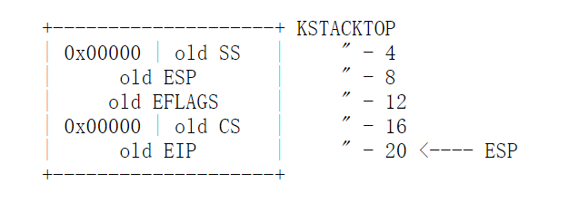
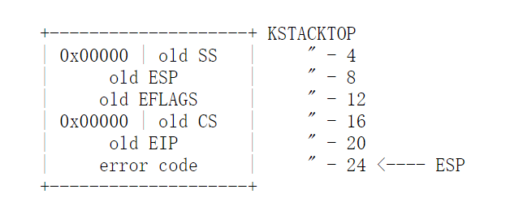
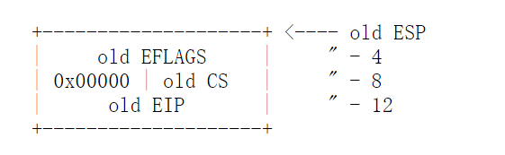
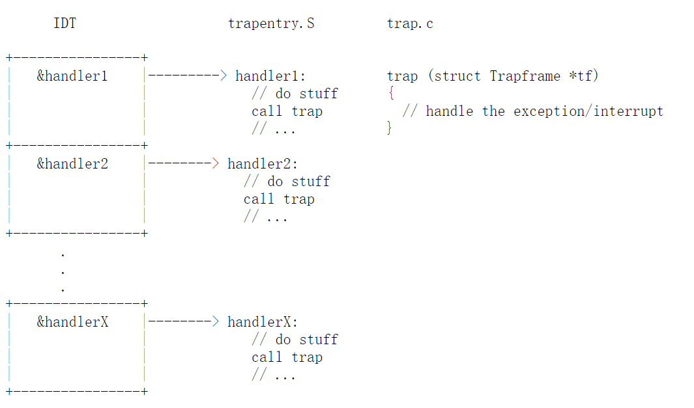

# Lab 3: User Environment 用户进程

## Introduction / 介绍

在本次实验中，你将实现使保护模式下的用户进程(英文原文是 environment，下同)得以运行的基础内核功能。在你的努力下，JOS 内核将建立起用于追踪用户进程的数据结构，创建一个用户进程，读入程序映像并运行。你也会使 JOS 内核有能力响应用户进程的任何系统调用，并处理用户进程所造成的异常。

**注意：** 本次实验的 *environment* 和 *process* 是可以互换的，它们都指的是使一个程序得以运行的抽象概念。我们引入 *environment* 这个术语而不是使用更通用的术语 *process*，是为了强调，JOS的 *环境* 和 UNIX 的 *进程* 提供不同的接口，也有着不同的语义。（译注：为了统一，我们仍然使用通用术语“进程”，如需要区分，则单独注明）

### Getting Start / 开始

使用 Git 来提交你在上交 Lab 2 之后的代码更改（如果有的话），~~从课程容器中获得最新版本的代码~~（我们不需要这么做），并基于我们的 lab3 分支 **origin/lab3** 创建一个新的本地分支 **lab3**：

```bash
cd ~/6.828/lab
git commit -am 'changes to lab2 after handin'
# git pull
git checkout -b lab3 origin/lab3
git merge lab2
```

Lab 3 包含一些新的源代码文件，你应该浏览一下：

| 目录 | 文件 | 说明 |
| ------ | ------ | ------ |
| inc/ | env.h | 用户模式进程的公用定义 |
|  | trap.h | 陷阱处理的公用定义 |
|  | syscall.h | 用户进程向内核发起系统调用的公用定义 |
|  | lib.h | 用户模式支持库的公用定义 |
| kern/ | env.h | 用户模式进程的内核私有定义 |
|  | env.c | 用户模式进程的内核代码实现 |
|  | trap.h | 陷阱处理的内核私有定义 |
|  | trap.c | 与陷阱处理有关的代码 |
|  | trapentry.S |	汇编语言的陷阱处理函数入口点 |
|  | syscall.h | 系统调用处理的内核私有定义 |
|  | syscall.c | 与系统调用实现有关的代码 |
| lib/ | Makefrag | 构建用户模式调用库的 Makefile fragment, obj/lib/libuser.a |
|  | entry.S | 汇编语言的用户进程入口点 |
|  | libmain.c | 从 entry.S 进入用户模式的库调用 |
|  | syscall.c | 用户模式下的系统调用桩(占位)函数 |
|  | console.c | 用户模式下 putchar() 和 getchar() 的实现，提供控制台输入输出 |
|  | exit.c	| 用户模式下 exit() 的实现 |
|  | panic.c | 用户模式下 panic() 的实现 |
| user/ | * |	检查 Lab 3 内核代码的各种测试程序 |

除此之外，我们在 lab2 提交过的一些源码文件在 lab3 中有所修改，可以通过 `git diff lab2` 来检查这些改动。

你也许会想要再看看这个 [实验用工具指南](http://oslab.mobisys.cc/pdos.csail.mit.edu/6.828/2014/labguide.html)，因为其中包含的调试用户代码相关的信息在本次实验中可能有用。

### Lab Requirements / 实验要求

本次实验包含两部分，A 和 B。A 在作业布置后的下一周截止，即使你的代码到那时还没能通过全部的打分脚本，你也应该在 Part A 截止日期之前提交你的修改（如果全部通过了，棒！）你只要在 Part B 截止之前，也就是第二个周末，通过全部的打分脚本就好了。

与 Lab 2 一样，你需要完成本次实验中的所有常规练习和 *至少一个* 挑战练习（整个实验完成一个就好了）。你也要为本次实验中的问题写个简要回答，并用一两段文字来描述你是如何完成你选择的挑战练习的，并将答案放在实验目录顶层的 **answers-lab3.txt** 中（如果你完成了不只一个挑战练习，你只需要在文件中介绍其中一个就好了）。不要忘了用 `git add answers-lab3.txt` 在你的提交中包含这个答案文件。

### Inline Assembly / 内联汇编

在本次实验中，你也许会发现 GCC 的内联汇编语言功能非常有用，虽然完全不用它就完成本次实验也是有可能的。不管怎样，你至少需要能够理解我们提供给你的源码中的内联汇编（**asm** 语句）。在这个[参考资料](http://oslab.mobisys.cc/pdos.csail.mit.edu/6.828/2014/reference.html)中可以找到一些有关 GCC 内联汇编的信息。

## Part A: User Environments and Exception Handling / 用户进程和错误处理

新的源码文件 `inc/env.h` 中包含一些 JOS 中用户进程的基础定义，现在就读读它。内核使用 **Env** 这个数据结构来追踪每一个用户进程。作为开始，本次实验你只需要创建一个进程就可以了，但是你需要通过设计，让 JOS 内核能够支持多个进程。 Lab 4 会利用到这个功能，使得用户进程可以通过 `fork` 来创建其他用户进程。

正如你在 `kern/env.c` 所见，内核维护三个与进程有关的主全局变量：

|  |  |
| ------ | ------ | ------ |
|struct Env *envs = NULL;	|	// 所有进程 |
|struct Env *curenv = NULL;	| // 当前正在运行的进程 |
|static struct Env *env_free_list; | // 空闲进程链表 |

当 JOS 启动并开始运行，`envs` 指针指向一个表示系统中所有进程的 `Env` 结构体的数组。在我们的设计中， JOS 内核会支持同时运行最多 `NENV` 个活动进程，虽然通常来说，任何时候运行的进程都会远比这个少（ `NENV` 是在 `inc/env.h` 中通过 `#define` 定义的常量）。`envs` 数组在初始化后，就包含为 NENV 个进程实例分配的 Env 结构体的空间。

JOS 内核将所有不活动的 `Env` 结构体放在 `env_free_list` 中，这种设计使得分配和销毁进程变得容易，因为只需要将结构体从 `env_free_list` 添上或者删掉就可以了。

内核用 `curenv` 符号来追踪某个给定时间点 *正在运行* 的进程。在启动过程中，第一个进程启动之前，`curenv` 被初始化成 `NULL`。

### Environment State / 进程状态

`inc/env` 中定义了 `Env` 结构体，在后续的实验中，我们还要在其中添加更多字段。

|  |  |
| ------ | ------ | ------ |
|struct Env | { |
|	struct Trapframe env_tf; | // 保存的寄存器 |
|	struct Env *env_link; | // 下一个空闲 Env |
|	envid_t env_id;	 | // 唯一进程标识符 |
|	envid_t env_parent_id; | // 父进程的 env_id  |
|	enum EnvType env_type; | // 标识特殊的系统进程 |
|	unsigned env_status; | // 进程状态 |
|	uint32_t env_runs; | // 进程的运行次数计数 |
|	// 地址空间 | |
|	pde_t *env_pgdir; | // 页目录的虚拟内存地址 |
|}; | |

 `Env` 中各个字段的用处：

  + **env_tf:**

    在 `inc/trap.h` 中定义的这个结构体，存储当进程 *没有* 在运行时被保存下来的寄存器的值。具体来说，当内核或者另一个不同的进程在运行的时候。内核在从用户模式切换到内核模式时将上一个进程的寄存器的值保存下来，从而进程可以从它被暂停的时间点恢复过来。

  + **env_link:**

    指向下一个位于 `env_free_list` 中的 `Env` 结构体的指针。`env_free_list` 指向链表中第一个空闲进程。

  + **env_id:**

    内核将可以唯一确定是哪个进程正在使用这个 `Env` 数组的标识符存储在这里（或者说，是哪个进程在占用 `envs` 数组中这个特定的位置）。当一个用户进程终止时，内核也许会将同一个 `Env` 结构分配给另一个进程，但即使新进程重复使用 `envs` 数组的同一个位置，它也将会拥有一个与旧进程不同的 `env_id`。

  + **env_parent_id:**

    内核在这里存储创建这个进程的进程的 `env_id`。通过这种方式，进程可以形成一个 `进程树` (family tree)，这样在做一些安全决定来确定某个进程能对哪些进程做什么时非常有用。

  + **env_type:**

    这一字段用来区别一些特殊的进程。对于大多数进程，它会是 `ENV_TYPE_USER`。在接下来的实验中我们将会引入一些其他类型，来表示特殊的系统服务进程。

  + **env_status:**

     这个变量的值可能是下面这些中的一个：
    + `ENV_FREE`: 这个 `Env` 结构未被利用，因此在 `env_free_list` 中。
    +  `ENV_RUNNABLE`: 表示一个正在等待进入处理器运行的进程。
    +   `ENV_RUNNING`: 表示目前正在运行的进程。
    +  `ENV_NOT_RUNNABLE`: 表示目前已经激活的进程，但是它还没有准备好运行，例如，它可能在等其他进程的进程间通信(interprocess communication, IPC)。
    + `ENV_DYING`: 表示一个僵尸进程。僵尸进程将在下一次陷入内核的时候被释放。在 Lab 4 之前，我们不会用到这个标记。

+ **env_pgdir:**

    这个变量储存这个进程的页目录的内核 *虚拟地址*

Like a Unix process, a JOS environment couples the concepts of "thread" and "address space". The thread is defined primarily by the saved registers (the env_tf field), and the address space is defined by the page directory and page tables pointed to by env_pgdir. To run an environment, the kernel must set up the CPU with both the saved registers and the appropriate address space. / 与 Unix 进程类似，JOS 进程的 "线程" 和 "地址空间" 概念也是成对的。线程是指保存的寄存器，也就是 `env_tf` 这个字段。而地址空间是指 `env_pgdir` 所指向的页目录和页表。要想运行一个进程，内核必须把保存的寄存器和正确的地址空间都送入 CPU。

我们的 `struct Env` 在某种意义上与 xv6 中的 `struct proc` 是相似的，它们都将进程的用户模式寄存器状态保存进一个叫 `Trapframe` 的结构。在 JOS 中，不同进程没有它们自己的内核栈，而在 xv6 中进程是有的。这是因为同一时刻 *只有一个* JOS 进程能够在内核中运行，所以 JOS 只需要一个内核栈。

### Allocating the Environments Array / 为进程数组分配空间

在 Lab 2 中，你通过 `mem_init()` 为 `pages[]` 数组分配了内存空间，内核通过这一数组追踪哪些页是空闲的，哪些页被占用了。现在，类似地，你需要进一步修改 `mem_init()` 来为 `Env` 结构体的数组， `envs`，分配内存。

::: exercise 练习 1.

修改 `kern/pmap.c` 中的 `mem_init()` 函数来 **分配** 并 **映射** `envs` 数组。这个数组恰好包含 `NENV` 个 `Env` 结构体实例，这与你分配 `pages` 数组的方式非常相似。另一个相似之处是，支持 `envs` 的内存储应该被只读映射在页表中 `UENVS` 的位置（于 `inc/memlayout.h` 中定义），所以，用户进程可以从这一数组读取数据。

修改好后，`check_kern_pgdir()` 应该能够成功执行。

:::

### Creating and Runnning Environments / 创建并运行进程

现在，你需要在 `kern/env.c` 中完成运行用户进程所必须的代码。因为我们还没有文件系统，我们需要让内核去加载 *嵌入内核自身* 的静态二进制映像。JOS 将这个二进制文件作为 ELF 可执行映像嵌在内核中。

Lab 3 的 `GNUmakefile` 在 `obj/user/` 目录生成了一些二进制映像。如果你看了 `kern/Makefrag` ，你会注意到某种魔法将这些二进制文件直接"链接"到了内核可执行文件中，就像是 `.o` 文件一样。链接器指令中的 `-b binary` 选项使得这些文件被链接成未经解释的二进制文件，而不是被链接成那种通常是编译器产生的 `.o` 文件（就链接器而言，这些文件并不必须是 ELF 映像，它们可以是任何东西，甚至是文本或者图片）。如果在内核构建完毕后看看 `obj/kern/kernel.sym` ，你会注意到链接器魔法地生成了一些非常有趣的，拥有诸如 `_binary_obj_user_hello_start`，`_binary_obj_user_hello_end` 和 `_binary_obj_user_hello_size` 这样有着晦涩名字的符号。链接器通过对二进制文件的文件名进行[命名修饰](https://en.wikipedia.org/wiki/Name_mangling)生成这些符号；这些符号为内核代码提供了一种引用这些嵌入的二进制文件的方式。

在 `kern/init.c` 的 `i386_init()` 方法中，你会看到运行其中一个二进制映像的的代码。然而，用于配置用户进程的关键函数还没有完成，你需要将其补全。

::: exercise 练习 2.

 在 `env.c` 中，完成接下来的这些函数：

+ **`env_init()`** 初始化全部 `envs` 数组中的 `Env` 结构体，并将它们加入到 `env_free_list` 中。还要调用 `env_init_percpu` ，这个函数会通过配置段硬件，将其分隔为特权等级 0 (内核) 和特权等级 3（用户）两个不同的段。

+  **`env_setup_vm()`** 为新的进程分配一个页目录，并初始化新进程的地址空间对应的内核部分。

+  **`region_alloc()`** 为进程分配和映射物理内存。

+  **`load_icode()`** 你需要处理 ELF 二进制映像，就像是引导加载程序(boot loader)已经做好的那样，并将映像内容读入新进程的用户地址空间。

+  **`env_create()`** 通过调用 `env_alloc` 分配一个新进程，并调用 `load_icode` 读入 ELF 二进制映像。

+  **`env_run()`** 启动给定的在用户模式运行的进程。

 当你在完成这些函数时，你也许会发现 cprintf 的新的 `%e` 很好用，它会打印出与错误代码相对应的描述，例如： `r = -E_NO_MEM; panic("env_alloc: %e", r);` 会 panic 并打印出 `env_alloc: out of memory`。

:::

 下面是直到用户代码被运行前的调用层次图，确定你明白了每一步的目的：

+ start (kern/entry.S)
+ i386_init (kern/init.c)
    + cons_init
    + mem_init
    + env_init
    + trap_init (这时候还不完整)
    + env_create
    + env_run
        + env_pop_tf

当你完成这些，你应该编译你的内核并在 QEMU 下运行。如果一切顺利，系统应该会进入用户空间并执行 `hello` 这个二进制文件，直到它尝试通过 `int` 指令进行系统调用。这时就会有麻烦了：因为 JOS 还没有设置好硬件来允许任何从用户空间到内核空间的切换。当 CPU 发现处理系统调用中断的方法还没有被配置，它会生成一个 general protection exception (一般保护异常)。然后它会发现这个异常也不能处理，于是生成一个 double fault exception (双错异常)。然后它发现还是不能处理，最终生成一个 "triple fault" 并放弃。通常，你将会见到 CPU 重置，系统会重启。虽然自动重启对于传统应用程序来说非常重要（[为什么？](http://blogs.msdn.com/larryosterman/archive/2005/02/08/369243.aspx)），但在内核开发的过程中非常令人头痛。所以在这次实验中用的修改版内核，你会看到寄存器转储和一个 "Triple fault" 的信息。

我们接下来就会解决这个问题，不过现在，我们可以用调试器来检查我们确实进入了用户模式。使用 `make qemu-gdb` 并在 `env_pop_tf` 处设置一个 GDB 断点，这应当是真正进入用户模式前所执行的最后一个内核函数。用 `si` 指令在这个函数中步进。处理器应该在一个 `iret` 指令后进入用户模式。
接下来，你应该能够看见用户进程的可执行代码的第一个指令：在 `lib/entry.S` 中 `start` 标签的 `cmpl` 指令。这时候，用 `b +0x...` 来在 **int $0x30** 处设置一个断点，这是 `hello` 中 `sys_cputs()` 这条指令（你需要看看 `obj/user/hello.asm` 来知道用户空间的地址）。 这个 `int` 是在控制台中显示一个字符的系统调用。如果不能执行到 `int`，说明你的地址空间配置或者读入用户程序的代码可能有问题，在继续之前回顾并修复好。

### Handling Interrupts and Exceptions / 处理中断和异常

此时，我们在用户空间的第一个 `int $0x30` 系统调用指令时走到了死胡同：一旦处理器进入用户模式，就再也没办法回到内核态了。现在，你需要实现基本的异常和系统调用处理，使得内核有可能从用户模式代码中取回处理器的控制权。你应该做的第一件事是彻底熟悉 x86 的中断和异常机制。

::: exercise 练习 3.

如果你还没有读过的话，读一读 [80386 Programmer's Manual](http://oslab.mobisys.cc/pdos.csail.mit.edu/6.828/2014/readings/i386/toc.htm) 中的 [Chapter 9, Exceptions and Interrupts](http://oslab.mobisys.cc/pdos.csail.mit.edu/6.828/2014/readings/i386/c09.htm) （或者 [IA-32 Developer's Manual](http://oslab.mobisys.cc/pdos.csail.mit.edu/6.828/2014/readings/ia32/IA32-3A.pdf) 的第五章）

:::

在本次实验中，我们大体上是遵照 Intel 所采用的关于中断、异常或者别的什么的术语。然而，像是 exception, trap, interrupt, fault 和 abort 这样的词，在不同架构体系或者操作系统中也没有什么标准含义。即使在某个特定的架构，比如 x86，用起它们来也通常不管它们间到底有什么细微的差别。当你在本次实验之外见到它们的时候，它们的含义也许会有些许不同。

### Basics of Protected Control Transfer / 保护控制转移基础

异常和中断都是"保护控制转移”，这些导致处理器从用户态转移到内核模式 ([CPL](https://en.wikipedia.org/wiki/Protection_ring#Privilege_level) = 0)，用户模式代码在这一过程中没有任何机会来干预内核或者其他进程的行为。在 Intel 的术语中，**中断** 是一个由异步事件造成的保护控制转移，这一事件通常是在处理器外部发生的，例如外接设备的 I/O 活动通知。相反，**异常** 是一个由当前正在运行的代码造成的同步保护控制转移，例如除零或者不合法的内存访问。

为了确保这些保护控制转移确实是受 **保护** 的，处理器的中断/异常处理机制被设计成当发生中断或异常时当前运行的代码 *没有机会任意选择从何处陷入内核或如何陷入内核*，而是由处理器确保仅在小心控制的情况下才能进入内核。在 x86 架构中，两种机制协同工作来提供这一保护：

  + **The Interrupt Descriptor table / 中断描述符表**
  处理器确保中断和异常只能导致内核进入一些确定的、设计优良的、 *由内核自身决定的* 入口点，而不是在发生中断或异常时由正在运行的代码决定。
  x86 允许最多 256 个不同的进入内核的中断或者异常入口点，每个有不同的 **中断向量**。向量是指从 0 到 255 的数字。一个中断的向量是由中断源决定的：不同的设备，不同的错误情况，或者应用向内核的不同请求会生成带有不同向量的中断。CPU 将向量作为进入处理器 **中断描述符表** 的索引，而这个中断描述符表是由内核在内核私有内存区域建立的，就像 GDT 一样。从这个表中对应的入口，处理器会读取：
    - 一个读入指令寄存器(EIP)的值，它指向用于处理这一类型异常的内核代码。
    - 一个读入代码段寄存器(CS)的值，其中包含一些 0-1 位来表示异常处理代码应该运行在哪一个特权等级（在 JOS 中，所有的异常都在内核模式处理，特权等级为0）。

  + **The Task State Segment / 任务状态段**
  处理器需要一处位置，用来在中断或异常发生前保存旧的处理器状态，比如，在处理器调用异常处理函数前的 **EIP** 和 **CS** 的值，使得随后异常处理函数可以恢复旧的状态并从中断的地方继续。但用于保存旧处理器状态的区域必须避免被非特权的用户模式代码访问到，否则有错误的或恶意的用户模式代码可能危及内核安全。
  因此，当 x86 处理器遇到使得特权等级从用户模式切换到内核模式的中断或陷阱时，它也会将栈切换到内核的内存中的栈。一个被称作 **任务状态段, TSS** 的结构体来描述这个栈所处的[段选择子](https://en.wikipedia.org/wiki/X86_memory_segmentation)和地址。处理器将 **SS**, **ESP**, **EFLAGS**, **CS**, **EIP** 和一个可能存在的错误代码压入新栈，接着它从中断向量表中读取 **CS** 和 **EIP**，并使 **ESP** 和 **SS** 指向新栈。
  即使 TSS 很大，可以服务于多种不同目的，JOS只将它用于定义处理器从用户模式切换到内核模式时的内核栈。因为 JOS 的 "内核模式" 在 x86 中是特权等级 0，当进入内核模式时，处理器用 TSS 结构体的 **ESP0** 和 **SS0** 字段来定义内核栈。JOS 不使用 TSS 中的其他任何字段。

### 异常和中断的类型

x86 处理器可产生的全部同步异常内部使用 0 ~ 31 作为中断向量，因此被映射为中断描述符表入口的 0 ~ 31。例如，一个缺页(page fault, 下同)总会通过向量 14 造成异常。大于 31 的中断向量只被用于 *软件中断*，这些中断可以用 int 指令生成，或者被用于 *异步硬件中断*，当外部设备需要提请注意时由其生成。

在这一节，我们将拓展 JOS 使其能够处理 x86 内部生成的 0 ~ 31 号异常。在下一节，我们将使得 JOS 能够处理软件中断向量 48 (0x30)，这是 JOS 任意选择的用于系统调用的中断向量。在 Lab 4 中我们还会继续拓展 JOS 使其能够处理外部生成的硬件中断，例如时钟中断。

### 一个例子

让我们将这些串起来，看一个例子。假定处理器正在某个用户进程执行代码，遇到了一个除法指令试图除零。

+ 处理器切换到 TSS 中由 **SS0** 和 **ESP0** 所定义的栈，JOS 会分别用来储存 **GD_KD** 和 **KSTACKTOP** 的值。
+ 处理器从 `KSTACKTOP` 开始，逐个将异常参数压入内核栈：
+ 因为我们正在处理除零错误，它在 x86 中的中断向量是 0， 因此处理器读取 IDT 入口 0，并将 **CS:EIP** 置为这一入口对应的处理函数。
+ 处理函数接管 CPU 并处理异常，例如，终止用户进程。

对于一些特定类型的 x86 异常，除了上面 "标准" 的 5 个字(word, 在 x86 中是 4 字节)以外，处理器还会在栈中压入另一个字，这个字是一个 *错误码* (error code)。一个重要的例子是 14 号中断，缺页(page fault)。你可以在 80386 手册中查到发生哪些中断时处理器会压入一个错误码，在这种情况下错误码的具体含义是什么。如果处理器压入错误码，在从用户模式切换，在执行异常处理函数前，栈看起来就会变成下面这个样子：

### 嵌套异常和中断

处理器在内核和用户模式都可能发生异常和中断，但是，只有在从用户模式进入内核模式时，x86 处理器才会在将旧寄存器状态压栈、通过IDT找到合适的异常处理函数并在调用前自动切换栈。如果中断或异常发生时处理器 *已经* 处于内核模式（ **CS** 寄存器的低 2 位已经是 00 了），CPU 就只会在同一个内核栈再压入更多的值。通过这种方式，内核可以优雅地处理由内核自己造成的 *嵌套异常*。这种能力是实现保护的重要工具，一会儿我们还会在系统调用这一节看到同样的机制。

如果处理器已经处于内核模式并发生了嵌套异常，因为它不需要切换栈，因此它也不需要保存旧的 **SS** 或者 **ESP** 寄存器。对于那些不会压入错误码的异常，内核栈在即将调用异常处理函数时是看起来这个样子：



对于那些会压入错误码的异常，处理器会在旧 `EIP` 之后立即压入错误码，和以前一样。

处理器处理嵌套异常的能力有一个重要限制：如果处理器发生异常时已经处于内核模式，而且因为某种理由 *不能将旧的状态压入内核栈*， 比如，栈已经没有足够空间了，那么处理器就没有任何可以搞定这个问题的办法了，所以它只会重置自己。不用多说，内核需要精巧的设计来保证这种情况不会发生。

### 设置中断描述符表(IDT)

现在，你应该对如何在 JOS 中设置 IDT 和处理异常有一些基本的了解了。从现在起，你需要设置 IDT 来处理 0 ~ 31 号中断向量(处理器异常)。我们将在本次实验接下来的部分处理系统调用中断，并在下一个实验中处理 32 ~ 47 号中断(设备 IRQ)。

头文件 `inc/trap.h` 和 `kern/trap.h` 包含一些与中断和异常处理有关的重要定义，你需要熟悉它们。`kern/trap.h` 包含一些严格内核私有的定义，而 `inc/trap.h` 包含一些在用户模式的程序和库也能利用到的定义。

注意：0 ~ 31 号中断向量中有一些是被 Intel 所预留的，因为它们从来不会被处理器生成，所以怎么处理它们也不太重要，你来做你认为最合适的就好。

你应该实现的整个流程就像下面这样：

每一个异常或者中断在 `trapentry.S` 中都应该有自己的处理函数， `trap_init()` 应该为这些处理函数初始化 IDT。每一个中断处理函数都应该在栈中建一个 `struct Trapframe` （见 `inc/trap.h` ），并且调用带一个指向 Trapframe (陷阱帧) 地址的参数的 `trap()` （在 `trap.c`）。接下来 `trap()` 就会处理这些异常，或者将其分发给特定的处理函数。

::: exercise 练习 4.

编辑 `trapentry.S` 和 `trap.c`，以实现上面描述的功能。 `trapentry.S` 中的宏定义 `TRAPHANDLER` 和 `TRAPHANDLER_NOEC`，还有在 `inc/trap.h` 中的那些 `T_` 开头的宏定义应该能帮到你。你需要在 `trapentry.S` 中用那些宏定义为每一个 `inc/trap.h` 中的 trap (陷阱) 添加一个新的入口点，你也要提供 `TRAPHANDLER` 宏所指向的 `_alltraps` 的代码。你还要修改 `trap_init()` 来初始化 `IDT`，使其指向每一个定义在 `trapentry.S` 中的入口点。`SETGATE` 宏定义在这里会很有帮助。
你的 `_alltraps` 应该
+ 将一些值压栈，使栈帧看起来像是一个 `struct Trapframe`
+ 将 `GD_KD` 读入 `%ds` 和 `%es`
+ `push %esp` 来传递一个指向这个 `Trapframe` 的指针，作为传给 `trap()` 的参数
+ `call trap` （思考：`trap` 这个函数会返回吗？）

考虑使用 `pushal` 这条指令。它在形成 `struct Trapframe` 的层次结构时非常合适。

用一些 `user` 目录下会造成异常的程序测试一下你的陷阱处理代码，比如 `user/divzero`。现在，你应该能在 `make grade` 中通过 `divzero`, `softint` 和 `badsegment` 了。

:::

::: challenge 挑战！

现在，无论是在 `trapentry.S` 中的 `TRAPHANDLER`，或者是配置它们的 `trap.c`中，你也许写了太多非常相似的代码了。试着整理一下。调整一下 `trapentry.S` 中的宏定义，让它自动生成一个给 `trap.c` 使用的表。注意，你可以在汇编中通过 `.text` 和 `.data` [(这是什么？)](https://en.wikipedia.org/wiki/Directive_(programming)) 来随时在代码段和数据段切换。

:::

::: question 问题

 在 `answers-lab3.txt` 中回答下面这些问题：
+ 对每一个中断/异常都分别给出中断处理函数的目的是什么？换句话说，如果所有的中断都交给同一个中断处理函数处理，现在我们实现的哪些功能就没办法实现了？
+ 你有没有额外做什么事情让 `user/softint` 这个程序按预期运行？打分脚本希望它产生一个一般保护错(陷阱 13)，可是 `softint` 的代码却发送的是 `int $14`。*为什么* 这个产生了中断向量 13 ？如果内核允许 `softint` 的 `int $14` 指令去调用内核中断向量 14 所对应的的缺页处理函数，会发生什么？

:::

到这里，本次实验的 Part A 就结束了。不要忘了将 `answers-lab3` 添加进 git，并提交你的修改，~~并在截止日期前运行 make handin~~（如果你已经在这时完成了 Part B，就不用再提交一次啦）。


## Part B: Page Faults, Breakpoints Exceptions, and System Calls / 缺页，断点与系统调用

现在，你的内核已经有一些处理基本异常的能力了。我们将会继续完善它，为其提供一些基于异常处理的重要的操作系统基本能力。

### Handling Page Faults / 缺页处理

中断向量 14, `T_PGFLT`. 对应的缺页异常，是在这次和下次实验中我们都会用到很多次的非常重要的一个异常。当处理器发生缺页时，它将造成缺页的线性(或者说，虚拟)地址存储在一个特别的处理器控制寄存器 `CR2` 中。在 `trap.c`，我们已经提供了一个特别的函数 `page_fault_handler()` 的开始，来处理缺页异常。

::: exercise 练习 5.

修改 `trap_dispatch()`，将缺页异常分发给 `page_fault_handler()`。你现在应该能够让 `make grade` 通过 `faultread`，`faultreadkernel`，`faultwrite` 和 `faultwritekernel` 这些测试了。如果这些中的某一个不能正常工作，你应该找找为什么，并且解决它。记住，你可以用 `make run-x` 或者 `make run-x-nox` 来直接使 JOS 启动某个特定的用户程序。

:::


接下来你将实现系统调用，这样就能让内核更有能力处理缺页了。

### The Breakpoint Exception / 断点

中断向量 3, `T_BKPT`, 所对应的断点异常通常用于调试器。调试器将程序代码中的指令临时替换为一个特别的 1 字节 `int3` 软件中断指令来插入断点，在 JOS 中，我们有一点点滥用这个功能，让它变为任何用户进程都可以唤起 JOS 内核监视器的伪系统调用。不过，如果我们把 JOS 内核监视器当成是最原始的调试器的话，这样做也许还蛮正确的。例如，在 `lib/panic.c` 中定义的用户模式下的 `panic()` 方法，就是打印出 panic message 之后调用一个 `int3`。

::: exercise 练习 6.

修改 `trap_dispatch()` 使断点异常唤起内核监视器。现在，你应该能够让 `make grade` 在 `breakpoint` 测试中成功了。

:::

::: challenge 挑战！

修改你的 JOS 内核，让你能够在断点之后从当前位置恢复运行，或者在断点之后继续单步运行。你需要理解 `EFLAGS` 中的某个特定的位来实现单步运行。

:::

::: challenge 可选

如果你非常热爱挑战，试着找一些 x86 反汇编代码，比如，从 QEMU 中拿到它，或者从 GNU binutils 中找找，或者自己写一些。拓展 JOS 内核监视器，使其能够反汇编并显示你正在单步执行的指令。结合我们在 lab 2 中实现的符号表，这些事情就是真正的内核调试器所做的了。

:::

::: question 问题

+ 断点那个测试样例可能会生成一个断点异常，或者生成一个一般保护错，这取决你是怎样在 IDT 中初始化它的入口的（换句话说，你是怎样在 `trap_init` 中调用 `SETGATE` 方法的）。为什么？你应该做什么才能让断点异常像上面所说的那样工作？怎样的错误配置会导致一般保护错？
+ 你认为这样的机制意义是什么？尤其要想想测试程序 `user/softint` 的所作所为 / 尤其要考虑一下 `user/softint` 测试程序的行为。

:::

### 系统调用

用户程序通过系统调用来请求内核为其做些事情。当用户进程进行系统调用时，处理器进入内核模式，处理器和内核协作来保存用户进程的状态，内核执行对应的代码来处理系统调用，并恢复用户进程。用户进程如何吸引内核注意并提出它的需求的具体方法根据系统的不同而不同。

在 JOS 内核中，我们使用会造成处理器中断的 `int` 指令。特别地，我们选用 `int $0x30` 作为系统调用中断。我们已经定义了一个常量，`T_SYSCALL` 为 48 (0x30)。你需要设立对应中断描述符来允许用户进程产生这个中断。注意，硬件不会产生中断 0x30，所以允许用户代码生成它也不会有什么歧义。

应用会将系统调用号和系统调用参数放入寄存器。这样的话，内核也不用去用户进程的栈或者指令流中到处找了。系统调用号会存在 `%eax` 中，最多 5 个参数会相应地存在 `%edx`, `%ecx`, `%ebx`, `%edi` 和 `%esi` 中。内核将返回值放在 `%eax` 中。发起系统调用的汇编代码已经为你写好了，在 `lib/syscall.c` 的 `syscall()` 。你应该读一读，确保你清楚到底发生了什么。

::: exercise 练习 7.

在内核中断描述符表中为中断向量 `T_SYSCALL` 添加一个处理函数。你需要编辑 `kern/trapentry.S` 和 `kern/trap.c` 的 `trap_init()` 方法。你也需要修改 `trap_dispath()` 来将系统调用中断分发给在 `kern/syscall.c` 中定义的 `syscall()`。确保如果系统调用号不合法，`syscall()` 返回 `-E_INVAL`。你应该读一读并且理解 `lib/syscall.c`（尤其是内联汇编例程）来确定你已经理解了系统调用接口。通过调用相应的内核函数，处理在 `inc/syscall.h` 中定义的所有系统调用。

通过 `make run-hello` 运行你的内核下的 `user/hello` 用户程序，它现在应该能在控制台中打印出 **hello, world** 了，接下来会在用户模式造成一个缺页。如果这些没有发生，也许意味着你的系统调用处理函数不太对。现在应该也能在 `make grade` 中通过 `testbss` 这个测试了。

:::

::: challenge 挑战！

通过使用 `sysenter` 和 `sysexit` 指令实现系统调用，而不是 `int 0x30` 和 `iret`。

这两个指令是 Intel 设计的，比 `int/iret` 要快很多的系统调用方式。他们用寄存器而不是栈，并且靠着推测段寄存器被如何使用来实现这一点。这些指令的细节实现可以在英特尔的参考手册的 Volume 2B 找到。

在 JOS 中支持这一方式最简单的办法是在 `kern/trapentry.S` 中添加一个 `sysenter_handler` 方法来保存回到用户环境所需要的足够的信息，设置内核环境，将 `syscall()` 所用到的参数入栈并直接调用 `syscall()`。一旦 `syscall()`返回，把一切准备就绪并执行 `sysexit` 指令。你同样也需要在 `kern/init.c` 中加入一些代码来提供必要的 model specific registers (MSRs)，Section 6.1.2 in Volume 2 of the AMD Architecture Programmer's Manual and the reference on SYSENTER in Volume 2B of the Intel reference manuals give good descriptions of the relevant MSRs. You can find an implementation of wrmsr to add to inc/x86.h for writing to these MSRs [here](http://www.garloff.de/kurt/linux/k6mod.c).  

最后，需要修改 `lib/syscall.c` 以支持通过 `sysenter` 来进行系统调用。这是一个可能的 `sysenter` 指令的寄存器结构：

  

GCC 的内联汇编器会自动保存那些你告诉它直接读入值的寄存器。不要忘了要么保存（入栈）和恢复（出栈）你所[覆写](https://en.wikipedia.org/wiki/Clobbering)的寄存器，要么告诉内联汇编器你准备覆写它们。内联汇编器不支持自动保存 `%ebp`，所以你需要加一些代码来自己保存和恢复它。可以通过使用像是 `leal after_sysenter_label, %%esi` 这样的指令将返回地址放入 `%esi` 中。

注意这样做只能支持 4 个参数，所以你需要把旧的系统调用方式保留下来来支持那些有 5 个参数的系统调用。而且，因为这个快速路径不会更新当前进程的陷阱帧，所以它也不适合我们接下来要加入的一些系统调用。  
一旦我们在下个实验中启用异步中断，你也许需要再回顾一下你的代码。具体来说，你应该需要在返回用户进程时启用中断，`sysexit` 不会帮你这么做。

:::

### 启动用户模式

用户程序在 `lib/entry.S` 之上开始运行。在一些初始化后，代码会调用在 `lib/libmain.c` 中的 `libmain()`。你应该修改 `libmain()` 来初始化全局指针 `thisenv` 来指向当前进程在 `envs` 数组对应的 `struct Env` (Note that lib/entry.S has already defined envs to point at the UENVS mapping you set up in Part A. / 注意在 Part A 中 `lib/entry.S` 已经定义了 `envs` 并指向了 `UENVS` 映射)。 提示：看一下 `inc/env.h` 并用上 `sys_getenvid`。

`libmain()` 接下来调用 `umain`，以 hello 这个程序为例，是 `user/hello.c`。注意，它在打出 `hello, world` 后，试图访问 `thisenv->env_id`。这是它之前出错的原因。现在，因为你已经初始化好了 `thisenv`，应该不会再出错了。如果它还是有问题，你也许没有正确的将 `UENVS` 映射为用户可读的（回到在 Part A 的 `pmap.c`，这是我们第一次使用 `UENVS` 这片内存区域的地方。）

::: exercise 练习 8.

在用户库文件中补全所需要的代码，并启动你的内核。你应该能看到 `user/hello` 打出了 `hello, world` 和 `i am environment 00001000`。接下来，`user/hello` 尝试通过调用 `sys_env_destory()` 方法退出（在 `lib/libmain.c` 和 `lib/exit.c`）。因为内核目前只支持单用户进程，它应该会报告它已经销毁了这个唯一的进程并进入内核监视器。在这时，你应该能够在 `make grade` 中通过 `hello` 这个测试了。

:::

### Page faults and memory protection / 缺页和内存保护

内存保护是操作系统一个至关重要的功能，用以保证一个程序的错误不会导致其他程序崩溃或者操作系统自身崩溃。

操作系统通常依赖硬件支持来实现内存保护。OS 保持与硬件同步哪些虚拟地址是有效的哪些是无效的。当一个程序试图访问无效的地址或者它无权访问的地址时，处理器可以在出错的指令处停止这个程序，并带着它要进行的操作等信息陷入内核。如果错误可以修正，内核可以修复它并让程序继续运行。如果错误不可修正，程序不能继续运行，因为它永远也不能通过这个造成异常的指令。

举个可以修复的错误的例子：自动拓展的堆栈。在许多系统中，内核最初只为用户程序分配 1 个栈页，如果程序试图访问栈更下面的页，内核会自动为这些页分配内存并让程序继续运行。这样做的话，内核只需要按用户程序所需分配内存，而程序也可以在自己拥有任意大的栈的幻想中工作 / 运行在不用考虑栈到底有多大的环境中。

系统调用提出了一个与内存保护有关的非常有趣的问题，多数系统调用接口允许用户程序向内核传递指针。这些指针指向提供给内核读取或写入的用户缓冲区。内核在执行系统调用时要对这些指针解引用，这样做存在两个问题：

+ 内核发生缺页可能要比在用户程序中缺页有更严重的潜在问题。如果内核在操作自身数据结构的时候发生缺页（内核错误），缺页处理函数应该让内核恐慌（也就是整个系统都会崩溃）。因此当内核对用户提供的指针解引用时，它需要一种办法记住发生的任何缺页事实上都是用户程序造成的。
+ 内核通常比用户程序拥有更多的内存权限。用户程序也许会为系统调用传递一个内核可以读写，那个用户程序却无权读写的的内存指针。内核必须小心不要被欺骗并解引用这样的指针，因为这样可能会泄露私有信息或者破坏内核的完整性。

因为这两个原因，内核在处理用户程序提供的指针时必须格外小心。

现在，你需要通过一种策略来仔细审视所有从用户空间传到内核的所有指针来解决这两个问题。当一个程序向内核传递指针时，内核需要检查指向的地址是否是用户空间的地址，也要检查页表是否允许对应的内存操作。

因此，内核从来不会因为对用户提供的指针解引用而发生缺页。如果内核真的发生缺页了，那么它就应该恐慌并终止。

::: exercise 练习 9.

修改 `kern/trap.c`，如果缺页发生在内核模式，应该恐慌。

提示：要判断缺页是发生在用户模式还是内核模式下，只需检查 `tf_cs` 的低位。

读一读 `kern/pmap.c` 中的 `user_mem_assert` 并实现同一文件下的 `user_mem_check`。

调整 `kern/syscall.c` 来验证系统调用的参数。

启动你的内核，运行 `user/buggyhello` (`make run-buggyhello`)。这个进程应该会被销毁，内核 *不应该* 恐慌，你应该能够看见类似

    [00001000] user_mem_check assertion failure for va 00000001
    [00001000] free env 00001000
    Destroyed the only environment - nothing more to do!

这样的消息。

最后，修改在 `kern/kdebug.c` 的 `debuginfo_eip`，对 `usd`, `stabs`, `stabstr` 都要调用 `user_mem_check`。修改之后，如果你运行 `user/breakpoint` ，你应该能在内核监视器下输入 `backtrace` 并且看到调用堆栈遍历到 `lib/libmain.c`，接下来内核会缺页并恐慌。是什么造成的内核缺页？你不需要解决这个问题，但是你应该知道为什么会发生缺页。（注：如果整个过程都没发生缺页，说明上面的实现可能有问题。如果在能够看到 `lib/libmain.c` 前就发生了缺页，可能说明之前某次实验的代码存在问题，也可能是由于 GCC 的优化，它没有遵守使我们这个功能得以正常工作的函数调用传统，如果你能合理解释它，即使不能看到预期的结果也没有关系。）

:::

你刚刚实现的机制对于恶意的用户程序应该也有效，试试 `user/evilhello`。

::: exercise 练习 10.

启动你的内核，运行 `user/evilhello`。进程应该被销毁，内核不应该恐慌，你应该能看到类似下面的输出：

    [00000000] new env 00001000
    [00001000] user_mem_check assertion failure for va f010000c
    [00001000] free env 00001000

:::

这次实验到这里就完成了。检查一下你是否通过了 `make grade` 的全部测试。不要忘了完成所有问题并将 1 个挑战练习的解答写在 `answer-lab3.txt` 中。提交你的更改 ~~并执行make handin来提交作业~~

在提交作业之前，用 `git status` 和 `git diff` 来检查一下你的修改，不要忘了 `git add answers-lab3.txt`。当你完成时，用 `git commit -am 'my solutions to lab 3'`来提交你的修改，~~并执行make handin~~。

---

译： Sun Yi-Ran (sunrisefox@vampire.rip)  

校： Sun Yi-Ran (sunrisefox@vampire.rip)

如有翻译错误，请务必联系喵 ，以便及时更正  

[CC BY-SA 4.0](https://creativecommons.org/licenses/by-sa/4.0/)

HTML 编译： [StackEdit](https://stackedit.io/)

编译脚本：

```javascript
Handlebars.registerHelper('transform', function (options) {
  var result = options.fn(this);
  var regex = /(<p>::: )([\w]+) ([^<\n]+?)(<\/p>\n)(.+?)(\n<p>:::<\/p>)/gms;
  var replace = '<section class="custom-block $2" type="$2"><strong>$3</strong>$5</section>';
  result = result.replace(regex, replace)
  result = result.replace(/<p>—section (.+?)—<\/p>/g, '<section type="$1">')
  result = result.replace(/<p>—end section—<\/p>/g, '</section>')
  return result;
});
```

```javascript
{{#transform}}{{{files.0.content.html}}}{{/transform}}
```
