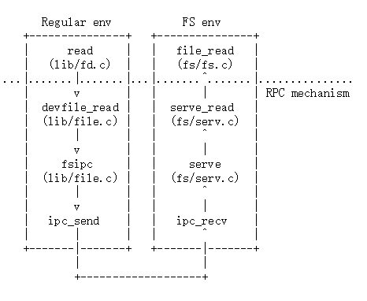

# Lab 5: File system, Spawn and Shell / 文件系统，Spawn 和 Shell

（译注：本次实验涉及磁盘操作，因此，如果使用 Windows 下的 Git 检出或提交，可能会导致 \n 被替换为 \r\n，进而导致无法通过打分脚本，请务必注意。）

## 引言

在本次实验中，你将会实现 `spawn` （就像是 environment 和 process 都指进程一样，这里的 spawn 和 fork 通常都可翻译为"派生"，但本次实验需要区分 fork 和 spawn，因此 spawn 这里保持不译），一个可以从磁盘中读取可执行文件并运行的库调用。接下来，你会完善你的内核和库调用，使操作系统足以在控制台执行一个 Shell。这些功能需要文件系统的支持，因此，本次实验将实现一个简单的读/写文件系统。

### 开始

使用 Git 来获得课程容器的最新源码，并基于我们的分支，`origin/lab5`，创建一个本地分支，`lab5` 。

```bash
cd ~/6.828/lab
git commit -am 'changes to lab4 after handin'
# git pull
git checkout -b lab5 origin/lab5
git merge lab4
```

这一部分实验主要的新组件是在新的 `fs` 文件夹中的文件系统进程。浏览一下文件夹中的全部文件，初步了解一下它们。除此之外，`user` 和 `lib` 文件夹下也有一些和文件系统有关的新文件。

|  |  |
|---|---|
|fs/fs.c | 操作文件系统磁盘结构的代码 |
|fs/bc.c | 建立在用户级别缺页处理功能上的简单的块缓存机制 |
|fs/ide.c | 最简的基于 PIO (非中断驱动的) IDE 驱动程序代码. |
|fs/serv.c | 文件系统服务器，与客户端通过文件系统 IPC 通信 |
|lib/fd.c | 实现通用 UNIX 样式的文件描述符接口代码 |
|lib/file.c | 磁盘文件类型的驱动程序，作为文件系统  IPC 客户端 |
|lib/console.c | 控制台输入输出文件类型的驱动程序 |
|lib/spawn.c | spawn 库调用的代码框架 |
| | |
在合并(merge)了 lab 5 的新代码之后，你应该再运行一下 lab 4 的 `pingpong`，`primes` 和 `forktree`。你需要注释掉在 `kern/init.c` 的 `ENV_CREATE(fs_fs)` 这一行，因为 `fs/fs.c` 会尝试做一些 I/O 操作，JOS 现在还不支持。相似的，临时注释掉 `lib/exit.c` 对 `close_all()` 的调用，这个函数会调用一些你在接下来将会实现的例程，因此此时调用会导致恐慌。如果你的 lab 4 代码没什么问题，这些测试样例应该还能正常工作。如果不能，那么就先不要继续。当你检查完，不要忘记取消注释刚才注释掉的函数。

如果 lab 4 的程序不能正常工作了，用 `git diff lab4` 来回顾下所有的改动，检查一下没有你在 lab 4 或者更之前的实验中完成的代码在 lab 5 中消失了。总之，确定 lab 4 还能正常工作再继续吧。

### 实验需求

像以前一样，你需要完成本次实验的全部常规练习和 *至少一个* 挑战练习。除此之外，你还需要为每一个问题写一个答案，并为你所完成的挑战练习写一个简短的一到两段的说明。如果你完成了不只一个挑战练习，你只需要在答案中介绍他们中的 1 个就可以了，当然，我们欢迎你做得更多。在提交作业前，记得把把答案放在 `lab5` 根目录的 `answers-lab5.txt` 中。

## 文件系统基础

你将实现的文件系统将远远比 xv6 UNIX 下的真正的文件系统要简单得多，但是它已经足以提供一些基本的功能了：创建、读、写、删除按照层次目录结构组织的文件，

我们（不管怎么说，到目前为止）实现的是只有一个用户的操作系统，虽然足够保护自己不受错误程序的破坏，但不会防止多个用户互相伤害 / 不会防止多个恶意用户对彼此造成损害。因此，我们的文件系统也不需要支持 UNIX 下关于文件所有权或者权限的部分。我们的文件系统目前也不支持大多数 UNIX 文件系统支持的硬链接、符号链接、时间戳或者特殊的的设备文件等。

### 磁盘上的文件系统结构

大多数 UNIX 文件系统将可用的磁盘空间划分为两个主要区域类型，*索引节点* 区 (inode regions) 和 *数据* 区 (data regions)。UNIX 文件系统为每一个文件系统中的文件分配一个 *索引节点*，一个索引节点存储这个文件的关键元数据，比如它的 `stat` 属性和指向的 *数据块*(data blocks) 的位置。数据区被分为要大很多的 *数据块* （通常来说，有 8KB 或者更大），在这些数据块中，文件系统可以存储文件数据和目录元数据。目录入口包含文件名和指向索引节点的指针；当文件系统中的多个目录入口包含同一个文件的索引节点时，我们就说这个文件被 *硬链接*(hard-linked) 了。因为我们的文件系统不支持硬链接，我们也不需要做这种不直接指向文件的层，因此可以做一个非常方便的简化：我们的文件系统根本就用不到索引节点，而是简单地把一个文件或者一个子目录的全部元数据都保存而且仅保存在它所在目录的入口点。

无论是文件还是目录，按理说都包含一系列数据块，这些数据块在磁盘上也是分散储存的，就像是一个进程的虚拟地址空间可以分散在物理内存的各个部分一样。文件系统进程隐藏了块这一层的细节，只为连续读写文件任意偏移量提供了接口，文件系统进程内部把所有对目录的修改都当做是诸如文件的创建和删除操作。我们的文件系统确实会允许用户进程直接 *读* 目录的元数据（比如，调用 `read` 方法），这意味着用户进程可以自己扫描目录（比如，实现 `ls` 方法）而不需要依赖对文件系统额外的调用。这样做目录扫描的缺点，或者说，大多数现代 UNIX 衍生都不提倡它的原因是，它使得应用程序依赖目录元数据的格式，如果需要调整文件系统内部实现的话，应用程序需要被改变或者至少重新编译。

#### 扇区和块

大多数磁盘不能按位读写，而是以 *扇区* (sectors) 为单位进行读写，如今，几乎所有的扇区都是 512 字节。而文件系统事实上是以 *块* (blocks) 为单位进行读写的。请注意，*扇区大小* 是磁盘硬件的属性，而 *块大小* 是操作系统如何使用磁盘这一层面，这两者是不同的概念。文件系统的块大小必须是其底层所用磁盘的扇区大小的整数倍。

UNIX 的 xv6 文件系统使用 512 字节作为块大小，和底层磁盘的扇区大小相同。更现代的文件系统块大小都会更大一些，因为存储空间变得越来越廉价了，块大小更大一些，管理起存储空间来就更有效率。我们的文件系统选择 4096 字节作为块大小，和处理器的页面大小是相同的，用起来比较方便。

#### superblocks / 超级块

文件系统通常在比较容易找到的位置保留一些特定的磁盘块（比如在最开始或者最末尾），用来存储整个文件系统的元数据，比如，块大小，磁盘大小，任何找到根目录所需的元数据，还有上次文件系统被挂载的时间，上次进行错误检查的时间等等。这些特殊的块被称为 *超级块*。

我们的文件系统恰好会有 1 个超级块，总会在磁盘的第 1 个区块的位置。它的层级结构定义在 `inc/fs.h` 的 `struct Super` 结构体中。第 0 个区块通常是预留给开机引导程序(boot loaders)和分区表的，所以文件系统通常不会使用这个最开始的区块。许多真实的文件系统会维护很多个超级块，在磁盘的几个广泛分布的区域存储相同的镜像，这样的话，如果其中一个被破坏了，或者磁盘某个区域有什么硬件错误，其他的超级块仍然可以被找到并通过它来访问文件系统。


#### 文件元数据

在我们的文件系统中，描述一个文件元数据的层次结构在 `inc/fs.h` 的 `struct File` 中定义。元数据包含文件名、大小、类型（是文件还是目录），指向组成这个文件的块的指针。正如之前提到的那样，我们没有索引节点，所以这样的元数据被存储在磁盘中对应目录的入口。和大多数真实的文件系统不同，为了简单，我们会用同一个这样的 `File` 结构体来表示内存和磁盘中的文件元数据。


`struct File` 中的 `f_direct` 数组包含文件最初 10 （`NDIRECT`）个块的块号，我们把它叫做这个文件的 *直接块* (direct block)。对于大小不超过 10 * 4096 = 40 KB 的小文件，这意味着这个文件用到的所有块的块号都可以存储在 `File` 这个结构体里。然而，对于大文件，我们需要一个区域来存储文件块号剩下的部分。所以，对于那些大于 40KB 的文件，我们需要再分配一个额外的磁盘块来存储 4096/4 = 1024 个额外的块号，这个额外的磁盘块被称为这个文件的 *间接块*。我们的文件系统因此允许文件最多占用 1034 个块，或者说，大概是 4 MB。为了支持更大的文件，真正的文件系统通常也会支持 *二级* 和 *三级间接块*。

#### 目录和一般文件

我们文件系统的 `File` 结构体既可以表示 *一般* 文件也可以表示目录。这两种“文件”类型是通过 `File` 结构体中的 `type` 字段来区分的。文件系统管理一般文件和目录的方式完全相同，除了，对于文件来说，文件系统完全不会去解析其数据块中的内容，而对于目录来说，文件系统会将其数据块解析成一系列 `File` 结构体，代表这个目录所包含的文件和子目录。

我们的文件系统的超级块包含一个 `File` 结构体（ `struct Super` 的 `root` 字段），存储着整个文件系统根目录的元数据。这个目录文件的内容是一系列 `File` 结构体，描述储存于文件系统根目录的文件和目录。所有根目录的子目录也同样包含更多的 `File` 结构体，来表示子目录的子目录，等等。

## 文件系统

本次实验的目标不是要实现整个文件系统，而是让你只实现一些关键部分。特别地，你需要实现如何把块读入块缓存中，并将其刷回磁盘；分配磁盘块；将文件偏移量与磁盘块对应；在 IPC 接口中实现文件的读、写、打开操作。因为你不必要亲自实现文件系统的其他部分，熟悉我们提供给你的代码和各种文件系统操作接口非常重要。

### 磁盘访问

我们操作系统的文件系统进程需要能够访问磁盘，但是我们还没在内核中实现任何磁盘访问功能。操作系统惯例的策略是为内核添加一个 IDE 磁盘驱动程序和必要的系统调用来允许文件系统读写磁盘，但我们不是这样做，而是在用户模式下通过文件系统进程来实现 IDE 磁盘驱动程序。不过我们还是需要稍微修改一下内核，为我们的文件系统进程提供它自己存取磁盘所必要的权限。

通过这种方式在用户空间实现磁盘读写比较简单，只要我们不用磁盘中断而是用基于[轮询](https://wiki.osdev.org/ATA_PIO_Mode#Polling_the_Status_vs._IRQs) 的 [程控I/O](https://en.wikipedia.org/wiki/Programmed_input/output) 的磁盘访问就可以了。当然，在用户模式下实现中断驱动的设备驱动程序也是有可能的，比如，L3 和 L4 内核就是这么做的，但是这样内核就必须响应设备中断并将其分发给正确的用户模式进程，相比来说要更难实现一些。

x86 处理器使用 EFLAGS 寄存器的 IOPL 位来决定保护模式下的代码是否能够进行像 IN 和 OUT 这样的特殊的设备 I/O 指令。因为我们需要访问的所有 IDE 磁盘寄存器都在 x86 的 I/O 空间，而没有被映射在内存地址中间中，为了允许文件系统进程访问这些寄存器，我们只需要给它 I/O 特权就好了。事实上，EFLAGS 寄存器的 IOPL 位为内核提供了一个 "all or nothing / 要么没有，要么全部" 的来控方式制用户模式的代码是否能访问 I/O 空间。在我们这个例子中，我们希望文件系统进程能够访问 I/O 空间，但我们不希望其他任何进程能够访问 I/O 空间。

::: exercise 练习 1.

`i386_init` 通过为进程创建函数，`env_create`， 传递 `ENV_TYPE_FS` 类型来标记这个进程是文件系统进程。修改 `env.c` 的 `env_create` 函数，使它给予文件系统进程 I/O 特权，而不要给其他任何进程文件系统特权。

确信你能够不触发一般保护错(General Protection Fault)的情况下启动文件进程。现在，你应该能够在 `make grade` 中通过 `fs i/o` 这一项了。

:::

::: question 问题

+ 除此之外，你还需要做其他别的事情来确保在切换进程的时候这个 I/O 特权设置能够被正确地保留下来吗？为什么？

:::

注意，本次实验的 `GNUmakefile` 会配置 QEMU 和以前一样使用 `obj/kern/kernel.img` 作为磁盘 0 的映像，并使用新的 obj/fs/fs.img 作为磁盘 1 的映像。对于 DOS/Windows，通常分别对应于 C: 和 D:。在本次实验中，我们的文件系统应该只需要对磁盘 1 进行操作，而磁盘 0 只用于启动内核。如果你不小心破坏了磁盘映像，你可以用下面的指令来把它们还原到最开始的状态：

```bash
rm obj/kern/kernel.img obj/fs/fs.img
make
```

或者

```bash
make clean
make
```

::: challenge 挑战！

实现一个中断驱动的 IDE 磁盘存取，使用或者不使用 DMA 均可。你可以决定是把磁盘驱动程序移至内核，还是继续把它和文件系统一起留在用户空间，甚至，如果你真的很想实现微内核之类的，也可以试试把它移至自己独有的环境中。

:::

### 块缓存

在我们的文件系统中，我们会在处理器的虚拟内存系统的帮助下，实现一个简单的”缓冲区缓存“（真的就是简单的块缓存）。实现块缓存的代码在 `fs/bc.c` 中。

我们的文件系统仅限于处理 3GB 以下的磁盘。我们在文件系统进程的地址空间预留一个大小 3GB 的，固定的空间，从 0x10000000 (`DISKMAP`) 直到 0xD0000000(`DISKMAP+DISKMAX`) 作为"映射到内存中的"磁盘。例如，磁盘的第 0 块被映射在虚拟地址的 0x10000000，第 1 块映射在虚拟地址的 0x10001000 等等。`fs/bc.c` 中的 `diskaddr` 函数实现了将磁盘块号转换为虚拟地址并进行一些有效性检查的方式。

因为我们的文件系统进程有着和系统中运行的其他进程完全不同的虚拟地址空间，而且它需要做的事只是实现文件存取，所以像这样保留其绝大部分地址空间用于块缓存也是合理的。在真正的文件系统实现中，如果是 32 位机器也这样做就会有些尴尬，因为现代的磁盘都远远大于 3GB。不过对于拥有 64 位地址空间的机器来讲，这样也许还是一种合理的缓冲区缓存管理的方法。

当然，如果把整个磁盘都读入内存就不太合理了。所以我们会实现某种形式的 `demand paging`，在这种情况下，我们只需要当在这个区域发生缺页时将相应的块从磁盘读入并映射到这个区域中。这样的话，我们可以假设整个磁盘都在内存中。

::: exercise 练习 2.

实现在 `fs/bc.c` 的 `bc_pgfault` 和 `flush_block` 方法。`bc_pgfault` 是一个缺页处理函数，就像是在上次实验中，你所写的 copy-on-write 的 fork 一样，除了它的工作是在缺页时从磁盘中将页读入内存。当完成这一部分时，不要忘了：1. `addr` 可能并没有和块边界对齐，2.  `ide_read` 方法操作的是扇区，而不是块。

`flush_block` 方法应该 *在必要时* 将块写回磁盘。如果一个块甚至都不在块缓存中（它根本没被映射），或者它还不是脏的，`flush_block` 应该什么都不做才对。我们会用 VM 硬件来追踪一个磁盘块在上次被读入或写回后有没有修改过。想知道它是否需要写回，我们只需要检查一下 `uvpt` 入口点的 `PTE_D` 脏位的值是不是被设置了（`PTE_D` 位是由处理器在写入某一页时设置的；可以看看 386 参考手册的[第五章](http://pdos.csail.mit.edu/6.828/2011/readings/i386/s05_02.htm)的 5.2.4.3）。将块写回磁盘后，`flush_block` 方法应该用 `sys_page_map` 来清除 `PTE_D` 位。

此时的 `make grade` 应该能够通过 `check_bc`，`check_super` 和 `check_bitmap` 了。

:::

在 `fs/fs.c` 中的 `fs_init` 函数是如何利用块缓存的最好的例子。初始化好块缓存之后，它会将磁盘映射区域的指针存储在 `super` 这个全局变量中。之后，我们只需要简单地从 `super` 结构体中读取就可以了，就好像它们在内存中一样。必要的话，我们的缺页处理函数会把它们读入磁盘。

::: challenge 挑战！

块缓存没有驱逐政策。一旦一个块在块缓存中出错，它将永远不会被从内存中移除。为缓冲区缓存添加一个驱逐策略。硬件每当访问一个页的时候，就会设置它页表入口的 `PTE_A` 位，因此不需要修改每一处访问磁盘的代码就可以大致追踪磁盘块的使用情况。注意留意对脏块的处理。

:::

### 块位图

在 `fs_init` 设置好 `bitmap` 指针之后，我们可以把 `bitmat` 视为打包起来的位的数组，每一位都代表磁盘上的一个块。比如，看一下 `block_is_free`，这个函数简单地检查给定的块在位图中是否被标记为空闲。

::: exercise 练习 3.

将 `free_block` 作为模型，实现 `alloc_block` 方法。这个方法应该在位图中找到一个空闲的磁盘块，将其标记为占用，并返回块的块号。When you allocate a block, you should immediately flush the changed bitmap block to disk with flush_block, to help file system consistency. / 每当你分配一个块时，你应该立即用 `flush_block` 将改变的位图块刷回磁盘，以保证文件系统的连续性。

此时，用 `make grade` 的话，你的代码应该能够通过 `alloc_block` 了。

:::

### 文件操作

我们在 `fs/fs.c` 中提供了一些你可能会需要的基本功能，比如解析和操作 `File` 结构体、扫描目录或操作目录文件的入口、从根开始遍历文件系统来得到文件绝对路径等。仔细读一读 `fs/fs.c` 的 *全部* 代码，确保你在继续之前已经理解了这些函数都做了什么。

::: exercise 练习 4.

实现 `file_block_walk` 和 `file_get_block`。`file_block_walk` 将文件内部的块偏移量对应于 `struct File` 中的相应的块或者间接块，非常像是 `pgdir_walk` 这个函数对页表做的那样。`file_get_block` 更进一步，将其对应于实际的磁盘块，如果有必要就分配个新的。

用 `make grade` 来测试一下你的代码，如果一切正常，应该能够通过 `file_open`, `file_get_block`, `file_flush/file_truncated/file rewrite` 和 `testfile` 这些测试了。

:::

file_block_walk and file_get_block are the workhorses of the file system. For example, file_read and file_write are little more than the bookkeeping atop file_get_block necessary to copy bytes between scattered blocks and a sequential buffer. / `file_block_walk` 和 `file_get_block` 是文件系统中可以依赖做重复工作的“工作马”(workhorse)，比如，`file_read` 和 `file_write`，在记账式的 `file_get_block` 的基础上，再进行稀疏块和连续缓冲区之间的数据拷贝就完全没必要了。

::: challenge 挑战！

如果在操作中途被打断（比如，崩溃或者重启）的话，文件系统很可能会损坏。实现一些软更新或者日志机制，来使得文件系统能不受崩溃的影响。描述某个情景，在这种情况下旧的文件系统会损坏，而你的文件系统不会。

:::

### 文件系统接口

现在，文件系统进程必须的功能我们都已经实现了。我们还需要让其他想要使用文件系统的进程能够和文件系统进程通信。因为其他进程不能直接调用文件系统进程的函数，我们需要通过 RPC (远程过程调用, Remote procedure call) 暴露出访问文件系统进程的抽象方法。这是建立在 JOS 的进程间通信(IPC)机制上的。以读文件为例，调用文件系统服务的过程直观上看起来是这样的：



点线下面都是从一般进程向文件系统进程发起读文件请求的简单机制。从头开始看，`read` (我们提供的)对任意文件描述符都能工作，并只是将其正确分发到对应设备的读函数。在这个例子中，是 `devfile_read`。这个 `devfile_read` 是从磁盘中读文件的方法（我们还有更多的设备类型，比如管道）。它和 `lib/file.c` 中的其他的 `devfile_*` 系列函数共同实现了在客户端的文件系统操作，工作方式大体上都差不多：把参数打包成请求结构体，调用 `fsipc` 来发送 IPC 请求，然后解包并返回结果。`fsipc` 方法只是简单的处理向服务器发送请求并接收回复。

文件系统服务端代码可以在 `fs/serv.c` 中被找到。它在 `serve` 函数中循环，无止境地尝试通过 IPC 接受请求，将请求分发给正确的处理函数，并将结果通过 IPC 发回去。在读取这个例子中，`serve` 会分发给 `serve_read`，它将会处理读请求的 IPC 具体细节，比如解包请求结构体，并最终调用 `file_read` 来真正进行文件的读操作。

回忆 JOS 的 IPC 机制，它允许进程发送一个 32 位的数字，并且也可选共享一个页。从客户端发给服务器的请求中，我们用这个 32 位的数字表示请求类型（文件系统服务的 RPC 也是有类型的，就像系统调用也是有类型的）并将参数放在随请求共享的页中的 `union Fsipc` 结构体中。在客户端一侧，我们总是共享 `fsipcbuf` 这个位置的页；在服务器一侧，我们总是把请求页映射到 `fsreq` 的位置（`0x0ffff000`）。

服务器也会将响应通过 IPC 发回去。我们用 32 位的数字来表示函数的返回值。对于大多数 RPC，这已经是响应的全部了。对于 `FSREQ_READ` 和 `FSREQ_STAT` 来说，它们虽然会返回数据，就直接写在客户端请求的那个页上就好了，没必要在响应的时候再带一个页，因为客户端请求的时候已经发送一个页给文件系统服务器了。Also, in its response, FSREQ_OPEN shares with the client a new "Fd page". We'll return to the file descriptor page shortly. / 而 `FSREQ_OPEN` 会在它的响应中分享给客户端一个新的"文件描述符页"。我们一会儿再介绍这个文件描述符页。

::: exercise 练习 5.

实现 `fs/serv.c` 的 `serve_read`

`serve_read` 几乎就是通过调用已经实现好了的 `fs/fs.c` 中的 `file_read` 来实现的（而，`file_read` 也就是一系列对 `file_get_block` 的调用）。`serve_read` 只需要提供用于读文件的 RPC 接口就好了。看看这些注释和 `serve_set_size` 中的代码来了解一下服务端代码的结构是怎样的。

此时用 `make grade` 应该能够通过 `serve_open/file_stat/file_close` 和 `file_read` 了。这时的得分应该是 65/145。

:::

::: exercise 练习 6.

实现 `fs/serv.c` 中的 `serve_write` 和 `lib/file.c` 中的 `devfile_write`。

此时用 `make grade` 应该能够通过 `file_write`、 `file_read after file_write`，`open` 和 `large file` 了。这时的得分应该是 85/145。

:::

## Spawning Processes

我们已经在 `lib/spawn.c` 中为你提供了创建新进程的 `spawn` 方法，它将一个程序映像从文件系统中读入，并启动一个子进程来运行它。父进程接下来将会独立于子进程继续运行。`spawn` 方法就像是在 UNIX 调用完 `fork` 之后立即在子进程中调用 `exec`。

我们实现 `spawn` 而不是 UNIX 那样的 `exec` 是因为 `spawn` 在用户空间以"外内核方式(exokernel fashion)"实现起来要更简单些，不需要内核的特别协助。想一想如果你需要在用户空间实现 `exec` 需要做些什么，确保你清楚为什么在用户空间实现起来会更难一些。

::: exercise 练习 7.

`spawn` 依赖新的系统调用 `sye_env_set_trapframe` 来初始化新创建的进程的状态。在 `kernel/syscall.c` 中实现 `sys_env_set_trapframe` （不要忘了在 `syscall()` 中分发这个新的系统调用！）

试试看，调整 `kern/init.c` 让它启动 `user/spawnhello` 这个程序，它将会试图从文件系统启动 `/hello`。

用 `make grade` 测试一下你的代码。

:::

::: challenge 挑战！

实现 Unix 样式的 `exec`。

:::

::: challenge 挑战！

实现 `mmap-`样式的内存映射的文件，并修改 `spawn`，使其如果可能，就从 ELF 映像直接映射页。

:::

### 在 fork 和 spawn 中共享库状态

UNIX 文件描述符是个非常广泛的概念，比如，也包括 管道，控制台输入输出，等等。在 JOS 中，每一个这样的设备类型都有一个相应的 `struct Dev` 结构体，结构体中存着相应的函数指针来实现对应设备类型相应的读写等操作。建立在其上的 `lib/fd.c` 实现了 UNIX 样式的文件描述符接口。每一个 `struct Fd` 包含着它对应的设备类型，`lib/fd.c` 中的大多数函数只是把相应的操作分发给对应的 `struct Dev` 中的处理函数。

`lib/fd.c` 也在每一个进程的地址空间维护一个 *文件描述符表* 区域，从 `FSTABLE` 开始。这个区域为每一个文件描述符预留大小为 1 页（4KB）的地址空间，最多可以保留 `MAXFD`（目前来说，最多 32 个）个同时打开的文件。在任何特定的时间点，一个特定的文件描述符表页当且仅当在它正在被使用时才会被映射。每一个文件描述符在这个区域也有一个可选的"数据页"，开始于 `FILEDATA` 这个位置，如果设备想用的话就可以使用。

我们希望在 `fork` 和 `spawn` 之间共享文件描述符的状态。但是文件描述符状态是在用户内存空间中的。目前，当 `fork` 时，内存会被标记为 copy-on-write，所以这个状态不是被共享了，而是被复制了。这意味着，进程如果没有亲自打开这个文件的话，是不能读取这个文件的，而且管道机制在 fork 中也不会工作。当 `spawn` 时，内存完全不会被复制或者共享（或者说，通过 spawn 产生的进程开始的时候没有任何打开的文件描述符）。

我们会调整 `fork`，让它知道内存中有些特定的区域是被这个库系统所使用的，所以总是被共享。不过我们也不会在某个地方写死一个会被库利用的内存区域列表，而是像 `PTE_COW` 一样，用页表中一个没有被使用的位来做标记。

我们在 `inc/lib.h` 定义了一个新的 `PTE_SHARE` 位。这一位是 Intel 和 AMD 手册上说的，提供给软件使用的 3 个 PTE 位之一。我们会建立一个规矩，如果页表入口的这一位被设置了，那么无论是 `fork` 还是 `spawn`，这个页表入口就应该直接从父进程复制到子进程中。注意，这个和 copy-on-write 是不同的，因为我们需要确保对这一页的修改是 *共享* 的。

::: exercise 练习 8.

修改 `lib/fork.c` 的 `duppage` 来遵照这个新的规矩。如果页表入口的 `PTE_SHARE` 这一位被设置了，应该直接拷贝这个映射。你应该用 `PTE_SYSCALL` 而不是 `0xffff` 来遮盖掉页表入口中相关的位， 因为 `0xffff` 会同时遮盖掉访问位和脏位。

与此类似，实现 `lib/spawn.c` 中的 `copy_shared_pages`。它应该循环查找当前进程的整个页表入口（就像 `fork` 做的那样，把所有有着 `PTE_SHARE` 标记的页直接复制给子进程。

:::

运行 `make run-testpteshare` 来检查你的代码是不是正确运行了。你应该能看见类似 `fork handles PTE_SHARE right` 和 `spawn handles PTE_SHARE right` 这样的提示。

运行 `make run-testfdsharing` 来检查文件描述符是否被正确地分享了。你应该能看到 `read in child succeeded` 和 `read in parent succeeded` 这样的提示。

## The keyboard interface / 键盘接口

为了让 shell 能够工作，我们需要找到一种在其中输入的方式。QEMU 会把输出显示到 CGA 显示器并送入输出串口，但是到目前为止，我们只能在内核监视器中输入数据。在 QEMU 中，在图形窗口中输入就是从键盘中输入到 JOS，而在控制台输入就是通过输入串口送入数据。 `kern/console.c` 已经包含了键盘和串口驱动程序，我们从 lab 1 开始内核监视器就在用它，但是现在，你需要把这些接到系统余下的各个部分。

::: exercise 练习 9.

在 `kern/trap.c` 中，调用 `kbd_intr` 来处理 `IRQ_OFFSET + IRQ_KBD`  这个陷阱。调用 `serial_intr` 来处理 `IRQ_OFFSET + IRQ_SERIAL` 这个陷阱。

:::

我们已经在 `lib/console.c` 中为你实现了控制台输入输出文件类型。 `kbd_intr` 和 `serial_intr` 会用最近读入的字符填充一个缓冲区，而控制台文件类型会从这个缓冲区中取出字符。默认情况下，控制台文件类型即作为标准输入输出，除非用户重定向了它们。

运行 `make run-testkbd` 并且打几行字。当你按下回车后，系统应该回显你打进去的内容。如果你能运行图形窗口的话，在控制台和在图形窗口中都试试看。（注：如果用于虚拟化 QEMU 的客户机没有 VGA 设备，比如 WSL，即，用 `make run-*-nox` 才能启动的话，就没有图形窗口。）

## The Shell

运行 `make run-icode` 或者 `make run-icode-nox`。这会启动你的内核，并运行 `user/icode.icode` 执行 `init`，它会将文件描述符 0 和文件描述符 1 设置为控制台（分别对应标准输入和标准输出）。接下来，它会 spawn `sh`，我们的 `shell`。你应该能够运行下面的这些命令：

```bash
echo hello world | cat
cat lorem |cat
cat lorem |num
cat lorem |num |num |num |num |num
lsfd
```

注意，用户库例程 `cprintf` 直接向控制台打印，而不使用文件描述符代码。这对于调试来说很棒，但是如果通过管道送给其他程序的话就很麻烦。想要打印输出到某个特定的文件描述符，比如 1，标准输出，可以用 `fprintf(1, "...", ...)`。`printf("...", ...)` 是输出到 1 号文件描述符的捷径。你可以在 `user/lsfd.c` 中找到例子。

::: exercise 练习 10.

shell 还不能支持 I/O 重定向。如果能够运行 `sh <script` 这样的代码，而不是直接把脚本中的各种命令打进去就好了。现在，为 `user/sh.c` 添加一个 I/O 重定向运算符 `<`。

如果实现好了，用 `sh <script` 来试试看。

运行 `make run-testshell` 来测试一下你的 shell。`testshell` 就是把 `fs/testshell.sh` 中的命令输入到 shell 并检查输出和 `fs/testshell.key` 是否一致（注：Windows 下使用 Git 检出可能会有行尾问题）。

:::

::: challenge 挑战！

为 Shell 添加更多的功能，包括但不限于（有一些可能需要也修改文件系统）：

+ backgrounding commands (ls &)
+ multiple commands per line (ls; echo hi)
+ command grouping ((ls; echo hi) | cat > out)
+ environment variable expansion (echo $hello)
+ quoting (echo "a | b")
+ command-line history and/or editing
+ tab completion
+ directories, cd, and a PATH for command-lookup.
+ file creation
+ ctl-c to kill the running environment

:::

现在，你的代码应该能够通过全部的测试了。像以前一样，你可以用 `make grade` 来看看会得到多少分数，~~并用 make handin 上交你的代码~~。

**到这里，这次实验就结束了。** 像以前一样，不要忘了运行 `make grade` 并为每一个问题和其中一个挑战练习写一份答案。在提交之前，用 `git status` 和 `git diff` 来检查一下你的修改，不要忘了 `git add answers-lab5.txt`。当你准备好，通过 `git commit -am 'my solutions to lab 5'` 提交你的修改，~~并用 make handin 来上交你的答案~~。

---

译： Sun Yi-Ran (sunrisefox@vampire.rip)

校： Sun Yi-Ran (sunrisefox@vampire.rip)

如有翻译错误，请务必联系喵 ，以便及时更正

[CC BY-SA 4.0](https://creativecommons.org/licenses/by-sa/4.0/)

HTML 编译： [StackEdit](https://stackedit.io/)

编译脚本：

```javascript
Handlebars.registerHelper('transform', function (options) {
  var result = options.fn(this);
  var regex = /(<p>::: )([\w]+) ([^<\n]+?)(<\/p>\n)(.+?)(\n<p>:::<\/p>)/gms;
  var replace = '<section class="custom-block $2" type="$2"><strong>$3</strong>$5</section>';
  result = result.replace(regex, replace)
  result = result.replace(/<p>—section (.+?)—<\/p>/g, '<section type="$1">')
  result = result.replace(/<p>—end section—<\/p>/g, '</section>')
  return result;
});
```

```javascript
{{#transform}}{{{files.0.content.html}}}{{/transform}}
```
